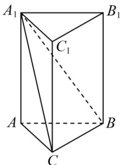

<!-- question-source:start -->
【变式2】如图，在直三棱柱 $ABC-A_{1}B_{1}C_{1}$ 中， $AB\perp AC$ ， $AB=AC=1$ ， $AA_{1}=2$ ，以 $\left\{\begin{array}{l} \square\square\square\square\square\square\square\square\square\square \\ AC,AB,\frac{1}{2}AA_{1}\end{array}\right\}$ 为单

位正交基底，建立空间直角坐标系 $A - xyz$

(1)求直线 $A_{1}B$ 的单位方向向量，并求点 C 到直线 $A_{1}B$ 的距离；

(2)求平面 $A_{1}BC$ 的法向量，并求点 $C_1$ 到平面 $A_{1}BC$ 的距离.
<!-- question-source:end -->

![[高中/课堂同步/题库/人教A版高中数学同步讲义(2026)/03_选择性必修第一册/第一章 空间向量与立体几何/第一章 空间向量与立体几何（高效培优讲义）/题型08_空间向量与立体几何的综合问题/questions/answers/Q00080000A1.md]]
