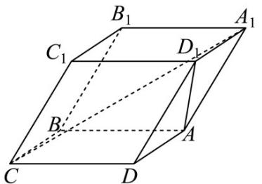
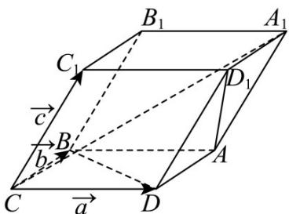

> [!faq]- 《第一章 空间向量与立体几何（高效培优讲义）》官方解析
>
> > [!success]- **【答案】**  A. $\frac{\sqrt{5}}{10}$ B. $\frac{\sqrt{10}}{10}$ C. $\frac{\sqrt{5}}{5}$ D. $\frac{\sqrt{2}}{2}$
>
> > [!note]- **【解析】**
> > 
> >
> > 如图，分别取 $\overline{CD}=a,\overline{CB}=b,\overline{CC_{1}}=c$ ，则 $|a|=|b|=|c|=4$
> >
> > 且 $a \cdot b = 0, a \cdot c = c \cdot b = 4 \times 4 \times \cos 60^{\circ} = 8$
> >
> > 而 $\overline{CA}_{1}=a+b+c,\overline{AD}_{1}=c-b,$
> >
> > 由 $\left|AD_{1}\right|=\sqrt{(c-b)^{2}}=\sqrt{c^{2}+b^{2}-2c\cdot b}=\sqrt{16+16-16}=4$
> >
> > $$
> > \left| \begin{array}{c} \square \square \square \\ C A _ {1} \end{array} \right| = \sqrt {(a + b + c) ^ {2}} = \sqrt {a ^ {2} + b ^ {2} + c ^ {2} + 2 (a \cdot b + a \cdot c + c \cdot b)} = \sqrt {1 6 \times 3 + 8 \times 2 \times 2} = 4 \sqrt {5}
> > $$
> >
> > $CA_{1}\cdot AD_{1}=(a+b+c)\cdot(c-b)=a\cdot c-a\cdot b-b^{2}+c^{2}=8-0-16+16=8$
> >
> > 设 $A_{1}C$ 与 $AD_{1}$ 的所成角为 $\theta$ ，
> >
> > 则 $\cos\theta=|\cos\langle\overrightarrow{CA_{1}},\overrightarrow{AD_{1}}\rangle|=\frac{|\overrightarrow{CA_{1}}\cdot\overrightarrow{AD_{1}}|}{|\overrightarrow{CA_{1}}|\cdot|\overrightarrow{AD_{1}}|}=\frac{8}{4\sqrt{5}\times4}=\frac{\sqrt{5}}{10}$
> >
> > 故选 **A**.
