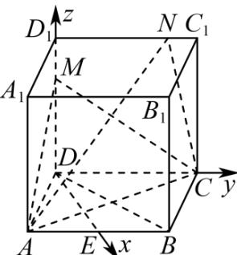

> [!faq]- 《第一章 空间向量与立体几何（高效培优讲义）》官方解析
>
> > [!success]- **【答案】** (1) $\left(3\sqrt{3},3,6\right)$ (2)6 (3)存在，点 N 在线段 $D_{1}C_{1}$ 上且与点 $D_{1}$ 的距离为 2
>
> > [!note]- **【解析】**
> > （1）依题意可得四边形 ABCD 是菱形，
> >
> > 又 $\angle BAD = 60^{\circ}$ ，连接 BD，则 $\triangle ABD$ 是正三角形，
> >
> > 取 AB 的中点 E，连接 DE，得 $DE \perp AB$ ， $DE \perp DC$ 。
> >
> > 因为四棱柱的侧棱与底面垂直，即 $DD_{1} \perp$ 平面ABCD
> >
> > 又 DE，DC ⊂ 平面 ABCD，所以 $DD_{1} \perp DE$ ， $DD_{1} \perp DC$ ，
> >
> > 所以 DE，DC， $DD_{1}$ 两两垂直。
> >
> > 则以 $D$ 为坐标原点，分别以 $\overline{DE}$ ， $\overline{DC}$ ， $\overline{DD_1}$ 为 $x$ 轴、 $y$ 轴、 $z$ 轴的正方向建立空间直角坐标系，如图.
> >
> > 
> >
> > 由直四棱柱 $ABCD - A_{1}B_{1}C_{1}D_{1}$ 的棱长均为 6，且 $AE \parallel DC$ ，
> >
> > 则 $AE = \frac{1}{2} DC = 3$ ，所以 $DE = \sqrt{AD^2 - AE^2} = 3\sqrt{3}$
> >
> > 从而点 $B_{1}$ 的坐标为 $(3\sqrt{3}, 3, 6)$
> >
> > (2) 由 $DM = 2MD_{1}$ ，则 $DM = 4$ ，
> >
> > 则结合（1）得 $D(0,0,0)$ ， $A(3\sqrt{3}, - 3,0)$ ， $C(0,6,0)$ ， $M(0,0,4)$
> >
> > 所以 $AC = (-3\sqrt{3}, 9, 0)$ ， $AM = (-3\sqrt{3}, 3, 4)$ ，设平面 ACM 的一个法向量为 $m = (x_{1}, y_{1}, z_{1})$
> >
> > 则 $\left\{ \begin{array}{l}m\cdot AC = 0\\ \rightarrow \\ m\cdot AM = 0 \end{array} \right.$ ，即 $\left\{ \begin{array}{l} - 3\sqrt{3} x_1 + 9y_1 = 0\\ -3\sqrt{3} x_1 + 3y_1 + 4z_1 = 0 \end{array} \right.$
> >
> > 取 $x_{1} = \sqrt{3}$ ，则 $y_{1} = 1$ ， $z_{1} = \frac{3}{2}$ 所以 $\vec{m} = \left(\sqrt{3}, 1, \frac{3}{2}\right)$
> >
> > 又 $MB_{1} = (3\sqrt{3}, 3, 2)$
> >
> > 所以点 $B_{1}$ 到平面 $\underset{ACM}{\longrightarrow}$ 的距离为 $d = \frac{\left|MB_1 \cdot m\right|}{\left|m\right|} = \frac{15}{\sqrt{3 + 1 + \frac{9}{4}}} = 6$
> >
> > (3) 设 $N(0, \lambda, 6)(0 \leq \lambda \leq 6)$ ，则 $CN = (0, \lambda - 6, 6)$
> >
> > 设平面 $ACN$ 的一个法向量为 $n = (x_{2},y_{2},z_{2})$
> >
> > 则 $\left\{ \begin{array}{l} n \cdot AC = 0 \\ \rightarrow \square \square \\ n \cdot CN = 0 \end{array} \right.$ ，即结合（2）得 $\left\{ \begin{array}{l} -3\sqrt{3} x_2 + 9y_2 = 0 \\ (\lambda - 6)y_2 + 6z_2 = 0 \end{array} \right.$
> >
> > 取 $x_{2} = \sqrt{3}$ ，则 $y_{2} = 1$ ， $z_{2} = \frac{6 - \lambda}{6}$ 所以 $\vec{n} = \left(\sqrt{3}, 1, \frac{6 - \lambda}{6}\right)$
> >
> > 又 $\vec{m} = \left(\sqrt{3}, 1, \frac{3}{2}\right)$
> >
> > 则 $\left|\cos m,n\right|=\frac{\left|\stackrel{\rightarrow}{m}\cdot n\right|}{\left|m\right|\left|n\right|}=\left|\frac{3+1+\frac{6-\lambda}{4}}{\frac{5}{2}\cdot\sqrt{\left(1-\frac{\lambda}{6}\right)^{2}+4}}\right|=\frac{3\sqrt{10}}{10}$ ，
> >
> > 化简得 $3\lambda^2 + 28\lambda - 68 = 0$ ，解得 $\lambda = 2$ 或 $-\frac{34}{3}$ ，
> >
> > 因为 $0 \leq \lambda \leq 6$ ，所以 $\lambda = 2$ ，即 $N(0,2,6)$
> >
> > 故当点 $N$ 在线段 $D_{1}C_{1}$ 上且与点 $D_{1}$ 的距离为2时，平面 $ACM$ 与平面 $ACN$ 夹角的余弦值为 $\frac{3\sqrt{10}}{10}$
