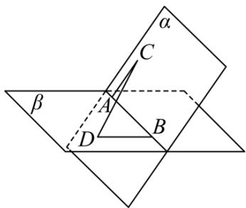

<!-- question-source:start -->
【变式3】如图，已知平面 $\alpha$ 与平面 $\beta$ 的夹角为 $60^{\circ}$ ，在平面 $\alpha$ 与平面 $\beta$ 的交线 $m$ 上有两点 $A, B$ ，线段 $AC, BD$ 分别在平面 $\alpha$ 与平面 $\beta$ 内，且都垂直于直线 $m$ ，若 $AC = 3, BD = 4, CD = \sqrt{73}$ ，则线段 $AB$ 的长度为 \_\_\_\_。

<!-- question-source:end -->

![[高中/课堂同步/题库/人教A版高中数学同步讲义(2026)/03_选择性必修第一册/第一章 空间向量与立体几何/讲义/专题1_1_空间向量及其运算_高效培优讲义_/_compact/answers/Q00062763A1.md]]
