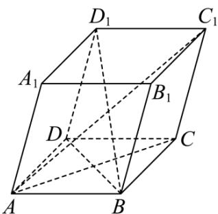

> [!faq]- 《专题1_1_空间向量及其运算_高效培优讲义_》官方解析
>
> > [!success]- **【答案】** $\sqrt{2}$
>
> > [!note]- **【分析】**
> > 将 $A_{1}C$ 用 $AB, AD, AA_{1}$ 表示，再求出 $A_{1}C^{2}$ ，得到 $|A_{1}C|$ .
>
> > [!note]- **【解析】**
> > 因为 $A_{1}C = AC - AA_{1} = AB + AD - AA_{1}$
> >
> > 所以 $A_{1}C^{2}=\left(AB+AD-AA_{1}\right)^{2}=AB^{2}+AD^{2}+AA_{1}^{2}+2AB\cdot AD-2AD\cdot AA_{1}-2AB\cdot AA_{1}$
> >
> > $$
> > = 3 + 2 \times 1 \times 1 \times \cos 6 0 ^ {\circ} - 2 \times 2 \times 1 \times 1 \times \cos 6 0 ^ {\circ} = 2
> > $$
> >
> > 则 $\left|A_{1}C\right|=\sqrt{2}$
> >
> > 
> >
> > 故答案为： $\sqrt{2}$
