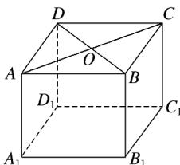

<!-- question-source:start -->
2.如图，在四棱柱的上底面ABCD中， $\mathrm{AB} = \mathrm{DC}$ ，则下列向量相等的是( )

A.AD与CB B.OA与OC C.AC与DB D.DO与OB
<!-- question-source:end -->

![[高中/课堂同步/题库/人教A版高中数学同步讲义(2026)/03_选择性必修第一册/第一章 空间向量与立体几何/讲义/专题1_1_空间向量及其运算_高效培优讲义_/即学即练_sec_04/questions/answers/Q00062741A1.md]]
