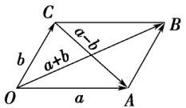

> [!faq]- 《专题1_1_空间向量及其运算_高效培优讲义_》官方解析
>
> > [!success]- **【答案】** D
>
> > [!note]- **【解析】**
> > 对于 A，AD 与 CB 的方向相反，因而不是相等向量，所以 A 错误；
> >
> > 对于 B，OA 与 OC 的方向相反，因而不是相等向量，所以 B 错误；
> >
> > 对于 C，AC 与 DB 的方向不同，因而不是相等向量，所以 C 错误；
> >
> > 对于 D，DO 与 OB 的方向相同，大小相等，是相等向量，因而 D 正确．故选 D
> >
> > 知识点 02 空间向量的线性运算
> >
> > (1)向量的加法、减法
> >
> > <table><tr><td rowspan="2">空间向量的运算</td><td>加法</td><td>OB = OA + OC = a + b</td><td rowspan="2"></td></tr><tr><td>减法</td><td>CA = OA - OC = a - b</td></tr><tr><td rowspan="2">加法运算律</td><td colspan="3">1交换律: a + b = b + a</td></tr><tr><td colspan="3">2结合律:(a + b) + c = a + (b + c)</td></tr></table>
> >
> > (2)空间向量的数乘运算
> > - **①**：定义：实数 $\lambda$ 与空间向量 a 的乘积 $\lambda a$ 仍然是一个向量，称为向量的数乘运算。
> >
> > 当 $\lambda > 0$ 时， $\lambda a$ 与向量 $a$ 方向相同；当 $\lambda < 0$ 时， $\lambda a$ 与向量 $a$ 方向相反；当 $\lambda = 0$ 时， $\lambda a = 0$ ； $\lambda a$ 的长度是 $a$ 的长度的 $|\lambda|$ 倍。
> > - **②**：运算律: 结合律 : $\lambda(\mu a) = \mu(\lambda a) = (\lambda \mu)a$ . 分配律 : $(\lambda + \mu)a = \lambda a + \mu a$ , $\lambda(a + b) = \lambda a + \lambda b$ .
> >
> > 【即学即练】
> >
> > 已知正方体 $ABCDA_{1}B_{1}C_{1}D_{1}$ ，则下列各式运算结果不是AC1的为( )
> >
> > A. AB + AD + AA1
> >
> > B. AA1 + A1B1 + A1D1
> >
> > C. AB + BC + CC1
> >
> > D. AB + AC + CC1
> >
> > 【解析】选项 A 中， $AB + AD + AA1 = AC + AA1 = AC1$ ；选项 B 中， $AA1 + A1B1 + A1D1 = AA1 + (A1B1 + A1D1) = AA1 + A1C1 = AC1$ ；选项 C 中， $AB + BC + CC1 = AC + CC1 = AC1$ ；选项 D 中， $AB + AC + CC1 = AB + (AC + CC1) = AB + AC1 \neq AC1$ 。
> >
> > 故选 **D**。
