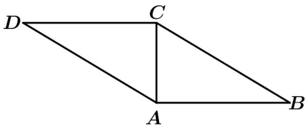

<!-- question-source:start -->
2.如图，在平行四边形ABCD中， $AB = 2AC = 2$ 且 $\angle ACD = 90^{\circ}$ ，将 $\triangle ABC$ 沿 $AC$ 折起，使 $AB$ 与 $CD$ 所成的角为 $60^{\circ}$ ：

(1)求 $AB \cdot CD$ ；(2)求点 $B$ ， $D$ 间的距离。
<!-- question-source:end -->

![[高中/课堂同步/题库/人教A版高中数学同步讲义(2026)/03_选择性必修第一册/第一章 空间向量与立体几何/讲义/专题1_1_空间向量及其运算_高效培优讲义_/即学即练_sec_11/questions/answers/Q00062745A1.md]]
