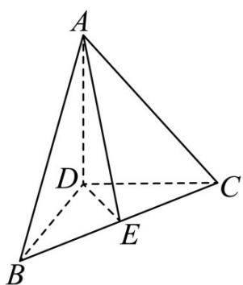

<!-- question-source:start -->
5．如图，在三棱锥 A-BCD 中，DA，DB，DC 两两垂直，且 DB=DC=DA=2，E 为 BC 的中点.

(1)证明： $AE \perp BC$ ；（用向量方法证明）

(2)求直线 AE 与 DC 所成角的余弦值.
<!-- question-source:end -->

![[高中/课堂同步/题库/人教A版高中数学同步讲义(2026)/03_选择性必修第一册/第一章 空间向量与立体几何/讲义/专题1_1_空间向量及其运算_高效培优讲义_/强化训练_sec_20/questions/answers/Q00062771A1.md]]
