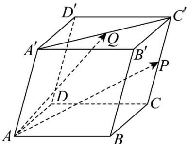

> [!faq]- 《专题1_1_空间向量及其运算_高效培优讲义_》官方解析
>
> > [!success]- **【答案】** (1) $\overline{AP}$ ，图示见解析；(2) $\overline{AQ}$ ，图示见解析·
>
> > [!note]- **【分析】**
> > 根据平行六面体基本性质及空间向量基本运算化简每个小题即可·
> >
> > $$
> > \stackrel {\square \square \square} {D C} + \stackrel {\square \square \square} {A ^ {\prime} D ^ {\prime}} + \frac {1}{2} \stackrel {\square \square \square} {C C ^ {\prime}} = \stackrel {\square \square \square} {D C} + \stackrel {\square \square \square} {A D} + \frac {1}{2} \stackrel {\square \square \square} {C C ^ {\prime}} = \stackrel {\square \square \square} {A C} + \frac {1}{2} \stackrel {\square \square \square} {C C ^ {\prime}}
> > $$
>
> > [!note]- **【解析】**
> > （1）
> >
> > 设 P 是线段 $CC'$ 的中点，
> >
> > 则 $DC + A'D' + \frac{1}{2} CC' = AC + CP = AP$
> >
> > 向量 $AP$ 如图所示·
> >
> > $$
> > \stackrel {\square \square \square} {A A ^ {\prime}} + \frac {1}{2} \stackrel {\square \square \square} {A B} + \frac {1}{2} \stackrel {\square \square \square} {A D} = \stackrel {\square \square \square} {A A ^ {\prime}} + \frac {1}{2} (\stackrel {\square \square \square} {A B} + \stackrel {\square \square \square} {A D}) = \stackrel {\square \square \square} {A A ^ {\prime}} + \frac {1}{2} \stackrel {\square \square \square} {A ^ {\prime} C ^ {\prime}}
> > $$
> >
> > 设 Q 是线段 $A^{\prime}C^{\prime}$ 的中点，
> >
> > 则 $AA' + \frac{1}{2}AB + \frac{1}{2}AD = AA' + \frac{1}{2}A'C' = AA' + A'Q = AQ$
> >
> > 向量 $AQ$ 如图所示·
> >
> > 
