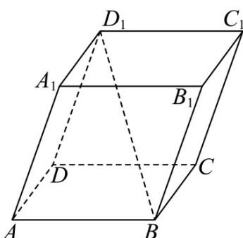

> [!faq]- 《专题1_1_空间向量及其运算_高效培优讲义_》官方解析
>
> > [!success]- **【答案】** D
>
> > [!note]- **【分析】**
> > 直接由公式 $\left|\overline{BD_{1}}\right|=\sqrt{\left(-AB+AD+AA_{1}\right)^{2}}$ 即可建立方程求解.
>
> > [!note]- **【解析】**
> > 
> >
> > 设 $\angle BAD = \theta$ ，注意到 $\left|BD_1\right| = \sqrt{\left(-AB + AD + AA_1\right)^2} = \sqrt{1 + 1 + 1 - 1 - 2\cos\theta + 1} = \sqrt{3 - 2\cos\theta} = \sqrt{3}$
> >
> > 所以 $\cos\theta=0$ ，所以 $\angle BAD=90^{\circ}$
> >
> > 故选：D.
> >
> > $14$ ．在空间四面体 $PABC$ 中，对空间内任意一点 $Q$ ，满足 $\boxed{PQ} = x\boxed{PA} + \frac{1}{3}\boxed{PB} + \frac{1}{4}\boxed{PC}$ ，则下列条件中可以确定
> >
> > 点 $Q$ 与A， $B$ ， $C$ 共面的为（）
> >
> > <!-- source-part:2 pages:51-53 -->
> >
> > A. $x = \frac{5}{12}$ B. $x = \frac{7}{12}$ C. $x = \frac{1}{2}$ D. $x = \frac{1}{8}$
> >
> > 【答案】A
> >
> > 【分析】根据空间向量四点共面列式即可得解·
> >
> > 【详解】因为 $PQ = xPA + \frac{1}{3}PB + \frac{1}{4}PC$
> >
> > 所以点 $Q$ 与A，B，C共面等价于 $x + \frac{1}{3} +\frac{1}{4} = 1$ ，即 $x = \frac{5}{12}$
> >
> > 故选 **A**.
