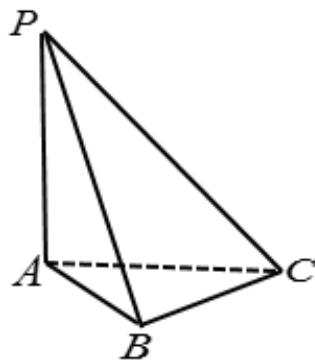

## 知识点 05 空间向量数量积的运算

空间向量的数量积

(1)定义：已知两个非零向量 $a, b$ ，则 $|a||b|\cos \langle a, b \rangle$ 叫做 $a, b$ 的数量积，记作 $a \cdot b$ . 即 $a \cdot b = |a||b|\cos \langle a,$

b> .

规定：零向量与任何向量的数量积为0.

(2)常用结论 $(a, b$ 为非零向量）

① $a \perp b \Leftrightarrow a \cdot b = 0$ . ② $a \cdot a = |a||a|\cos \langle a, a \rangle = |a|^2$ . ③ $\cos \langle a, b \rangle = .$

(3)数量积的运算律

<table><tr><td>数乘向量与数量积的结合律</td><td> $(\lambda a) \cdot b = \lambda (a \cdot b) = a \cdot (\lambda b)$ </td></tr><tr><td>交换律</td><td> $a \cdot b = b \cdot a$ </td></tr><tr><td>分配律</td><td> $a \cdot (b + c) = a \cdot b + a \cdot c$ </td></tr></table>

【即学即练】

如图，在三棱锥 $P - ABC$ 中， $PA \perp$ 平面 $ABC$ ， $CB \perp AB$ ， $AB = BC = a$ ， $PA = b$ 。

(1)确定 $PC$ 在平面 $ABC$ 上的投影向量，并求 $PC \cdot AB$ ；

(2)确定 $PC$ 在 $AB$ 上的投影向量，并求 $PC \cdot AB$

【答案】(1) $PC$ 在平面 $ABC$ 上的投影向量为 $AC$ ， $PC \cdot AB = a^2$ ；(2) $PC$ 在 $AB$ 上的投影向量为 $AB$

$PC\cdot AB = a^2$

(1)因为 $PA \perp$ 平面 ABC，所以 PC 在平面 ABC 上的投影向量为 AC，

因为 $PA \perp$ 平面 $ABC$ ， $AB \mid$ 面 $ABC$ ，可得 $PA \perp AB$ ，所以 $PA \cdot AB = 0$ ，因为 $CB \perp AB$ ，所以 $BC \cdot AB = 0$

所以 $\overline{PC} \cdot \overline{AB} = \left( \overline{PA} + \overline{AB} + \overline{BC} \right) \cdot \overline{AB} = \overline{PA} \cdot \overline{AB} + \overline{AB} \cdot \overline{AB} + \overline{BC} \cdot \overline{AB} = 0 + a^{2} + 0 = a^{2}$

(2)由（1）知： $PC \cdot AB = a^{2}$ ， $\left|AB\right| = a$ ，所以PC在AB上的投影向量为：

$$
\left| \overrightarrow {P C} \right| \cdot \cos \left\langle \overrightarrow {P C}, \overrightarrow {A B} \right\rangle \cdot \frac {\overrightarrow {A B}}{\left| A B \right|} = \left| \overrightarrow {P C} \right| \cdot \frac {\overrightarrow {P C} \cdot \overrightarrow {A B}}{\left| P C \right| \cdot \left| A B \right|} \cdot \frac {\overrightarrow {A B}}{\left| A B \right|} = \frac {\overrightarrow {P C} \cdot \overrightarrow {A B}}{\left| A B \right|} \cdot \frac {\overrightarrow {A B}}{\left| A B \right|} = \frac {a ^ {2}}{a} \cdot \frac {\overrightarrow {A B}}{a} = \overrightarrow {A B}
$$

由数量积的几何意义可得： $PC\cdot AB = \left|AB\right|\cdot \left|AB\right| = a^2$
