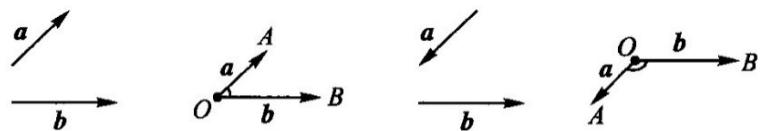
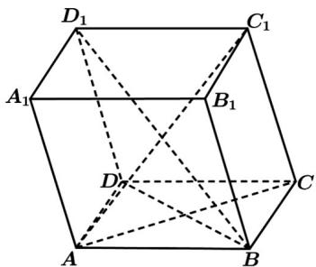

## 知识点 06 利用数量积证明空间垂直关系

当 $a \perp b$ 时， $a \cdot b = 0$ .

【即学即练】

如图，正方体 $ABCD - A_{1}B_{1}C_{1}D_{1}$ 的棱长是 $a$ ， $CD_{1}$ 和 $DC_{1}$ 相交于点 $O$ ：

(1)求 $\overset{\text{UUUU}}{CD_{1}}\cdot\overset{\text{UUUU}}{CD}$ ; (2)求 $\overset{\text{UUUU}}{AO}$ 与 $\overset{\text{UUUU}}{CB}$ 的夹角的大小余弦值；(3)判断 $\overset{\text{UUUU}}{AO}$ 与 $\overset{\text{UUUU}}{CD_{1}}$ 是否垂直.

【解析】(1)正方体 $ABCD-A_{1}B_{1}C_{1}D_{1}$ 中， $CD_{1}=\sqrt{2}a,CD_{1},CD=\frac{\pi}{4}$ ，故 $CD_{1}\cdot CD=\sqrt{2}a\times a\times\cos\frac{\pi}{4}=a^{2}$ ;

(2)由题意知， $AB \cdot AD = 0, AB \cdot AA_{1} = 0, AA_{1} \cdot AD = 0, AO = AD + DO = AD + \frac{1}{2}(AB + AA_{1})$

$|AO|=\sqrt{[AD+\frac{1}{2}(AB+AA_{1})]^{2}}=\frac{\sqrt{6}a}{2}$ ，故 $AO\cdot CB=-AO\cdot AD=-[AD+\frac{1}{2}(AB+AA_{1})]\cdot AD=-a^{2}$

$\cos AO, CB = \frac{AO \cdot CB}{|AO| \cdot |CB|} = \frac{-a^2}{\frac{\sqrt{6}}{2} a \cdot a} = -\frac{\sqrt{6}}{3}$ 故，故 $AO$ 与 $CB$ 的夹角的大小余弦值为 $\frac{\sqrt{6}}{3}$ ；

(3)由题意， $AB\cdot AD = 0,AB\cdot AA_{1} = 0,AA_{1}\cdot AD = 0$ ， $AO\cdot CD_{1} = [AD + \frac{1}{2}(AB + AA_{1})]\cdot (AA_{1} - AB) = \frac{1}{2} AA_{1}^{2} - \frac{1}{2} AB^{2} = 0$

故 $AO$ 与 $CD_{1}$ 垂直.

知识点 07 夹角问题

1. 定义：已知两个非零向量 $a$ 、 $b$ ，在空间任取一点 $\mathbf{D}$ ，作 $\overline{OA} = a, \overline{OB} = b$ ，则 $\angle AOB$ 叫做向量 $a$ 与 $b$ 的夹

角，记作 $\langle a,b\rangle$ ，如下图。

根据空间两个向量数量积的定义： $a\cdot b = |a|\cdot |b|\cdot \cos \langle a,b\rangle$ ，那么空间两个向量 $a$ 、 $b$ 的夹角的余弦 $\cos \langle a,b\rangle = \frac{a\cdot b\rightarrow}{|a|\cdot|b|}$ 。

2. 利用空间向量求异面直线所成的角

异面直线所成的角可以通过选取直线的方向向量，计算两个方向向量的夹角得到。

在求异面直线所成的角时，应注意异面直线所成的角与向量夹角的区别：如果两向量夹角为锐角或直角，则

异面直线所成的角等于两向量的夹角；如果两向的夹角为钝角，则异面直线所成的角为两向量的夹角的补角。

【即学即练】

如图，在平行六面体 $ABCD - A_{1}B_{1}C_{1}D_{1}$ 中，底面 $ABCD$ 是边长为2的正方形，侧棱 $AA_{1}$ 的长度为4，且

$\angle A_{1}AB = \angle A_{1}AD = 120^{\circ}$ .用向量法求:

(1) $BD_{1}$ 的长;

(2)直线 $BD_{1}$ 与 AC 所成角的余弦值.

【答案】(1) $2\sqrt{6}(2)\frac{\sqrt{3}}{3}$

$$
B D _ {1} = B B _ {1} + B _ {1} A _ {1} + A _ {1} D _ {1}
$$

$$
\stackrel {{\sqcup \sqcup \sqcup}} {{B D _ {1}}} ^ {2} = \left(\stackrel {{\sqcup \sqcup \sqcup}} {{B B _ {1}}} + \stackrel {{\sqcup \sqcup \sqcup}} {{B _ {1} A _ {1}}} + \stackrel {{\sqcup \sqcup \sqcup}} {{A _ {1} D _ {1}}}\right) ^ {2} = \stackrel {{\sqcup \sqcup \sqcup}} {{B B _ {1}}} ^ {2} + \stackrel {{\sqcup \sqcup \sqcup}} {{B _ {1} A _ {1}}} ^ {2} + \stackrel {{\sqcup \sqcup \sqcup}} {{A _ {1} D _ {1}}} ^ {2} + 2 \stackrel {{\sqcup \sqcup \sqcup}} {{B B _ {1}}} \cdot \stackrel {{\sqcup \sqcup \sqcup}} {{B _ {1} A _ {1}}} + 2 \stackrel {{\sqcup \sqcup \sqcup}} {{B B _ {1}}} \cdot \stackrel {{\sqcup \sqcup \sqcup}} {{A _ {1} D _ {1}}} + 2 \stackrel {{\sqcup \sqcup \sqcup}} {{B _ {1} A _ {1}}} \cdot \stackrel {{\sqcup \sqcup \sqcup}} {{A _ {1} D _ {1}}}
$$

$= 16 + 4 + 4 + 2 \times 4 \times 2 \cos 60^{\circ} + 2 \times 4 \times 2 \cos 120^{\circ} + 0 = 24$ ，故 $\left|BD_{1}\right| = 2\sqrt{6}$ ，所以 $BD_{1}$ 的长为 $2\sqrt{6}$ ；

$$
A C \cdot B D _ {1} = \left(A B + B C\right) \cdot \left(B B _ {1} + B _ {1} A _ {1} + A _ {1} D _ {1}\right) = A B \cdot B B _ {1} + A B \cdot B _ {1} A _ {1} + A B \cdot A _ {1} D _ {1} + B C \cdot B B _ {1} + B C \cdot B _ {1} A _ {1} + B C \cdot A _ {1} D _ {1}
$$

$$
= 2 \times 4 \cos 1 2 0 ^ {\circ} - 4 + 0 + 2 \times 4 \cos 1 2 0 ^ {\circ} + 0 + 4 = - 8
$$

$\left|\overline{A C}\right| = \sqrt{\left( \overline{A B} + \overline{B C} \right)^2} = \sqrt{ \overline{A B}^2 + 2 A B \cdot BC + \overline{B C}^2} = 2\sqrt{2}$ ，由（1）知： $\left|\overline{B D_1}\right| = 2\sqrt{6}$

设直线 $BD_{1}$ 与 $AC$ 所成角为 $\theta$ : $\cos \theta = \left|\cos \left\langle AC, BD_{1} \right\rangle\right| = \left|\frac{AC \cdot BD_{1}}{|AC| \cdot |BD_{1}|}\right| = \left|\frac{-8}{2\sqrt{2} \times 2\sqrt{6}}\right| = \frac{\sqrt{3}}{3}$ ,

∴直线 $BD_{1}$ 与 AC 所成角的余弦值为 $\frac{\sqrt{3}}{3}$
