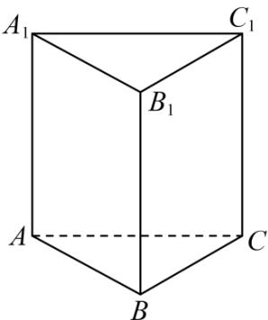

<!-- question-source:start -->
【变式2】如图，在正三棱柱 $ABC-A_{1}B_{1}C_{1}$ 中，P为空间一动点，若 $BP=\lambda\overline{BC}+\mu\overline{BB}_{1}\left(\lambda,\mu\in[0,1]\right)$ ，则

( )

A. 若 $\lambda = \mu$ ，则点 $P$ 的轨迹为线段 $BC_{1}$

B．若 $\lambda + \mu = 1$ ，则点 P 的轨迹为线段 $B_{1}C$

C．存在 $\lambda,\mu\in(0,1)$ ，使得 $AP\perp BC$

D．存在 $\lambda,\mu\in(0,1)$ ，使得 $AP \parallel$ 平面 $A_{1}B_{1}C_{1}$
<!-- question-source:end -->

![[高中/课堂同步/题库/人教A版高中数学同步讲义(2026)/03_选择性必修第一册/第一章 空间向量与立体几何/讲义/专题1_1_空间向量及其运算_高效培优讲义_/题型02_共线向量定理的应用_sec_14/questions/answers/Q00062750A1.md]]
