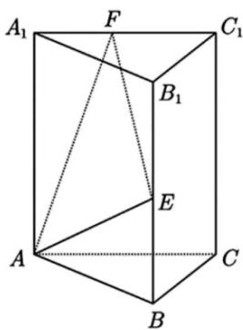

<!-- question-source:start -->
【变式3】如图，三棱柱 $ABC-A_{1}B_{1}C_{1}$ 中，E为 $BB_{1}$ 的中点，F满足 $A_{1}F=\frac{1}{3}A_{1}C_{1}$ ，过A,E,F作三棱柱的截面交 $B_{1}C_{1}$ 于M，且 $B_{1}M=\lambda MC_{1}$ ，则实数 $\lambda$ 的值为（）

A. $\frac{1}{4}$ B. $\frac{1}{3}$ C. $\frac{2}{5}$ D. $\frac{3}{5}$
<!-- question-source:end -->

![[高中/课堂同步/题库/人教A版高中数学同步讲义(2026)/03_选择性必修第一册/第一章 空间向量与立体几何/讲义/专题1_1_空间向量及其运算_高效培优讲义_/题型03_共面向量及应用_sec_15/questions/answers/Q00062754A1.md]]
