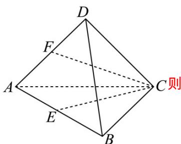

> [!faq]- 《专题1_1_空间向量及其运算_高效培优讲义_》官方解析
>
> > [!success]- **【答案】** D
>
> > [!note]- **【解析】**
> > 因为点 $E, F$ 分别为棱 $AB, AD$ 的中点，且四面体 $ABCD$ 所有棱长均为 2，
> >
> > 
> >
> > ，所以
> >
> > $$
> > C F = \left(\frac {1}{2} C D + \frac {1}{2} C A\right), C E = \left(\frac {1}{2} C A + \frac {1}{2} C B\right)
> > $$
> >
> > $$
> > C F \cdot C E = \left(\frac {1}{2} C D + \frac {1}{2} C A\right) \cdot \left(\frac {1}{2} C A + \frac {1}{2} C B\right)
> > $$
> >
> > $$
> > = \frac {1}{4} \left(\left| C D \right| \cdot \left| C A \right| \cdot \cos 6 0 ^ {\circ} + \left| C D \right| \cdot \left| C B \right| \cdot \cos 6 0 ^ {\circ} + \left| C A \right| ^ {2} + \left| C A \right| \cdot \left| C B \right| \cdot \cos 6 0 ^ {\circ}\right) = \frac {1}{4} \left(2 \times 2 \times \frac {1}{2} + 2 \times 2 \times \frac {1}{2} + 2 ^ {2} + 2 \times 2 \times \frac {1}{2}\right) = \frac {5}{2}.
> > $$
> >
> > 故选 **D**
