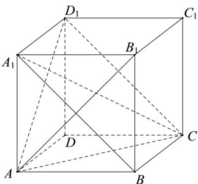

> [!faq]- 《专题1_1_空间向量及其运算_高效培优讲义_》官方解析
>
> > [!success]- **【答案】** AB
>
> > [!note]- **【解析】**
> > 
> >
> > 对于 $\mathsf{A}$ ，由向量的加法运算得到
> >
> > $$
> > A _ {1} A + A _ {1} D _ {1} + A _ {1} B _ {1} = A _ {1} C
> > $$
> >
> > $\because A_{1}C^{2} = 3A_{1}B_{1}^{2}$ ， $\therefore \overline{A_1C}^2 = 3\overline{A_1B_1}^2$ ，故A正确；对于B， $\because \overline{A_1B_1} -\overline{A_1A} = \overline{AB_1},AB_1\bot A_1C$ ， $\therefore \overline{A_1C}\cdot \overline{AB_1} = 0$ ，故B正
> >
> > 确；对于 $C$ ， $\because \triangle ACD_{1}$ 是等边三角形， $\angle AD_{1}C = 60^{\circ}$ ，又 $A_{1}B//D_{1}C$ ，∴异面直线 $AD_{1}$ 与 $A_{1}B$ 所成的角为 $60^{\circ}$ ，但
> >
> > 是向量 $\overline{AD_{1}}$ 与向量 $\overline{A_{1}B}$ 的夹角是 $120^{\circ}$ ，故 $^{C}$ 错误；对于 $^{D}$ ， $\because AB \perp AA_{1}$ ， $\therefore AB \cdot AA_{1} = 0$ ，则 $\left|\left(\overline{AB} \cdot \overline{AA_{1}}\right)\overline{AD}\right| = 0$
> >
> > 故 $^{D}$ 错误．
> >
> > 故选 **AB**．
