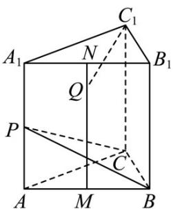

<!-- question-source:start -->
【变式1】如图所示，正三棱柱 $ABC - A_{1}B_{1}C_{1}$ 的所有棱长均为1，点 $P$ 、 $M$ 、 $N$ 分别为棱 $AA_{1}$ 、 $AB$ 、 $A_{1}B_{1}$ 的中

点，点 $Q$ 为线段 $MN$ 上的动点．当点 $Q$ 由点 $N$ 出发向点 $M$ 运动的过程中，以下结论中正确的是（）

A. 直线 $C_{1}Q$ 与直线 $CP$ 可能相交 B. 直线 $C_{1}Q$ 与直线 $CP$ 始终异面

C. 直线 $C_{1}Q$ 与直线 $CP$ 可能垂直 D. 直线 $C_{1}Q$ 与直线 $BP$ 不可能垂直
<!-- question-source:end -->

![[高中/课堂同步/题库/人教A版高中数学同步讲义(2026)/03_选择性必修第一册/第一章 空间向量与立体几何/讲义/专题1_1_空间向量及其运算_高效培优讲义_/题型07_利用空间向量的数量积证垂直_sec_19/questions/answers/Q00062764A1.md]]
