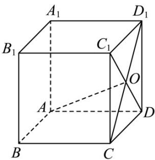

<!-- question-source:start -->
【变式2】如图，正方体 $ABCD - A_{1}B_{1}C_{1}D_{1}$ 的棱长是 $a$ ， $CD_{1}$ 和 $DC_{1}$ 相交于点 $O$ ：

(1)求 $CD_{1}\cdot CD$ ; (2)判断 $AO$ 与 $CD_{1}$ 是否垂直.
<!-- question-source:end -->

![[高中/课堂同步/题库/人教A版高中数学同步讲义(2026)/03_选择性必修第一册/第一章 空间向量与立体几何/讲义/专题1_1_空间向量及其运算_高效培优讲义_/题型07_利用空间向量的数量积证垂直_sec_19/questions/answers/Q00062765A1.md]]
