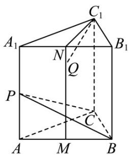

> [!faq]- 《专题1_1_空间向量及其运算_高效培优讲义_》官方解析
>
> > [!success]- **【答案】** B
>
> > [!note]- **【解析】**
> > 在正三棱柱 $ABC-A_{1}B_{1}C_{1}$ 中，因为点 M、N 分别为棱 AB、 $A_{1}B_{1}$ 的中点，所以 $MN//AA_{1}$
> >
> > 又 $MN \not\subset$ 平面 $AA_{1}C_{1}C$ ， $AA_{1} \subset$ 平面 $AA_{1}C_{1}C$ ，所以 $MN //$ 平面 $AA_{1}C_{1}C$ ，因为 $C_{1}, P, C \in$ 平面 $AA_{1}C_{1}C$ ， $C_{1} \notin PC$
> >
> > $Q \in MN$ ，所以 $C_1, P, C, Q$ 四点不共面，所以直线 $C_1Q$ 与直线 $CP$ 始终异面，故 ${}^{\mathrm{A}}$ 错误， ${}^{\mathrm{B}}$ 正确；
> >
> > 对于 C，设 $NQ = \lambda MN (0 \leq \lambda \leq 1)$
> >
> > 则 $QC_{1} = QN + NC_{1} = \lambda MN + \frac{1}{2} NA_{1} + A_{1}C_{1} = \lambda AA_{1} + AC - \frac{1}{2} AB$ ， $CP = \frac{1}{2} AA_{1} - AC$
> >
> > 若直线 $C_1Q$ 与直线 $CP$ 垂直，则 $\overline{QC_1} \cdot \overline{CP} = 0$
> >
> > 即 $\left(\lambda AA_{1} + AC - \frac{1}{2} AB\right) \cdot \left(\frac{1}{2} AA_{1} - AC\right) = 0$
> >
> > 所以 $\frac{\lambda}{2} AA_{1}^{2}-\lambda AA_{1}\cdot AC+\frac{1}{2} AA_{1}\cdot AC-AC^{2}-\frac{1}{4} AA_{1}\cdot AB+\frac{1}{2} AB\cdot AC=0$
> >
> > 即 $\frac{\lambda}{2} - 1 + \frac{1}{2} \times 1 \times 1 \times \frac{1}{2} = 0$ ，解得 $\lambda = \frac{3}{2}$ ，
> >
> > 因为 $0 \leq \lambda \leq 1$ ，所以不存在点 Q 使得直线 $C_{1}Q$ 与直线 CP 垂直，故 C 错误；
> >
> > 对于 D，连接 $C_{1}N$ ，
> >
> > 因为 $C_1A_1 = C_1B_1, N$ 为 $A_1B_1$ 的中点，所以 $C_1N \perp A_1B_1$ ，又因 $AA_1 \perp$ 平面 $A_1B_1C_1$ ， $C_1N \subset$ 平面 $A_1B_1C_1$
> >
> > 所以 $AA_{1} \perp C_{1}N$ ，因为 $AA_{1} \cap A_{1}B_{1}, AA_{1}, A_{1}B_{1} \subset$ 平面 $ABB_{1}A_{1}$ ，所以 $C_{1}N \perp$ 平面 $ABB_{1}A_{1}$
> >
> > 又 $BP \subset$ 平面 $ABB_{1}A_{1}$ ，所以 $C_{1}N \perp BP$
> >
> > 所以当点 $Q$ 在 $N$ 的位置时，直线 $C_1Q$ 与直线 $BP$ 垂直，故 $\mathsf{D}$ 错误
> >
> > 
> >
> > 故选 **B**.
