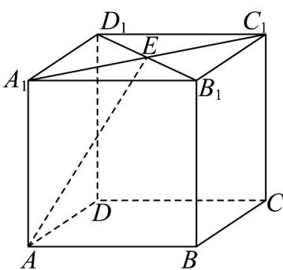

> [!faq]- 《专题1_2_空间向量基本定理_高效培优讲义_》官方解析
>
> > [!success]- **【答案】** D
>
> > [!note]- **【分析】**
> > 根据空间向量对应线段的关系，结合加减、数乘的几何意义用 $AA_{1}, AB, AD$ 表示 $AE$ 求出参数，即可
> >
> > 得答案·
>
> > [!note]- **【解析】**
> > 由 $AE = AA_{1} + A_{1}E = AA_{1} + \frac{1}{2}A_{1}C_{1} = AA_{1} + \frac{1}{2}(AB + AD) = AA_{1} + \frac{1}{2}AB + \frac{1}{2}AD$ 所以 $x = 1, y = z = \frac{1}{2}$ ，故 $x + y + z = 2$ .
> >
> > 故选：D
> >
> > 
