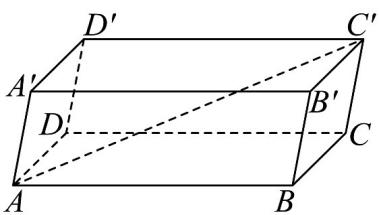

> [!faq]- 《专题1_2_空间向量基本定理_高效培优讲义_》官方解析
>
> > [!success]- **【答案】** A
>
> > [!note]- **【分析】**
> > 用空间向量基本定理表示出 $AC'$ ，然后平方后转化为数量积的运算求得。
>
> > [!note]- **【解析】**
> > 解：如图，
> >
> > 
> >
> > 可得 $AC' = AB + BC + CC' = AB + AD + AA'$
> >
> > 故 $\left|AC'\right|^{2}=\left(AB+AD+AA'\right)^{2}$
> >
> > $$
> > = \left| \overline {{A B}} \right| ^ {2} + \left| \overline {{A D}} \right| ^ {2} + \left| \overline {{A A ^ {\prime}}} \right| ^ {2} + 2 \left(\overline {{A B}} \cdot \overline {{A D}} + \overline {{A B}} \cdot \overline {{A A ^ {\prime}}} + \overline {{A D}} \cdot \overline {{A A ^ {\prime}}}\right) = 4 ^ {2} + 3 ^ {2} + 3 ^ {2} + 2 \left(4 \times 3 \times 0 + 4 \times 3 \times \frac {1}{2} + 3 \times 3 \times \frac {1}{2}\right) = 5 5
> > $$
> >
> > $$
> > \therefore A C ^ {\prime} = \sqrt {5 5}
> > $$
> >
> > 故选 **A**
