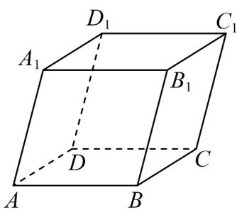

<!-- question-source:start -->
2．如图，在平行六面体 $ABCD - A_1B_1C_1D_1$ 中，设 $a = AA_{1}$ ， $b = DB_{1}$ ，若 $a$ 、 $b$ 、 $c$ 组成空间向量的一个基底，

则 $c$ 可以是（ ）

A $\overset{\cup\cup\cup}{BB_{1}}$ B $\overset{\cup\cup\cup}{BC_{1}}$ C $\overset{\cup\cup\cup}{BD}$ D $\overset{\cup\cup\cup}{BD_{1}}$
<!-- question-source:end -->

![[高中/课堂同步/题库/人教A版高中数学同步讲义(2026)/03_选择性必修第一册/第一章 空间向量与立体几何/讲义/专题1_2_空间向量基本定理_高效培优讲义_/即学即练_sec_04/questions/answers/Q00062782A1.md]]
