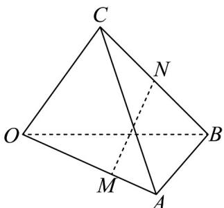

<!-- question-source:start -->
3.如图，在四面体 $OABC$ 中， $OA = a$ ， $OB = b$ ， $OC = c$ ，且 $OM = 2MA$ ， $BN = NC$ ，则 $MN = (\quad)$

$$
\frac {2}{3} a + \frac {2}{3} b + \frac {1}{2} c
$$

$$
\frac {2}{3} a + \frac {2}{3} b - \frac {1}{2} c
$$

$$
- \frac {2}{3} a + \frac {1}{2} b + \frac {1}{2} c
$$

$$
\frac {1}{2} a - \frac {2}{3} b + \frac {1}{2} c
$$
<!-- question-source:end -->

![[高中/课堂同步/题库/人教A版高中数学同步讲义(2026)/03_选择性必修第一册/第一章 空间向量与立体几何/讲义/专题1_2_空间向量基本定理_高效培优讲义_/强化训练_sec_14/questions/answers/Q00062801A1.md]]
