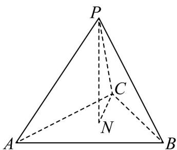

<!-- question-source:start -->
11. 如图，在边长为 $2$ 的正四面体 $P - ABC$ 中， $N$ 是 $\mathrm{V}ABC$ 的中心，则下列正确的是（）

A. $PA \cdot BC = 4$

$$
P N = \frac {1}{3} P B + \frac {1}{3} B C + \frac {1}{3} B A
$$

B. $PA \cdot AB = 2$

$$
P N = \frac {1}{3} P B + \frac {1}{3} P C - \frac {1}{3} A P
$$
<!-- question-source:end -->

![[高中/课堂同步/题库/人教A版高中数学同步讲义(2026)/03_选择性必修第一册/第一章 空间向量与立体几何/讲义/专题1_2_空间向量基本定理_高效培优讲义_/强化训练_sec_14/questions/answers/Q00062808A1.md]]
