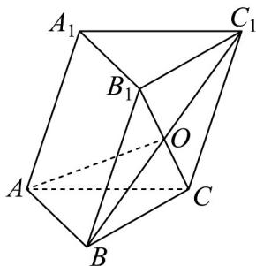
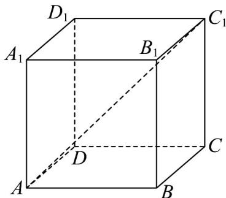

> [!faq]- 《专题1_2_空间向量基本定理_高效培优讲义_》官方解析
>
> > [!success]- **【答案】** C
>
> > [!note]- **【分析】**
> > 利用空间向量加减、数乘的几何意义，结合三棱柱中各线段的位置关系用 $AB$ 、 $AC$ 、 $AA_{1}$ 表示出 $AO$ ，再应用空间向量数量积的运算律求 的模长，从而得解．
>
> > [!note]- **【解析】**
> > 如下图所示：
> >
> > 
> >
> > 因为 $\angle A_{1}AB = \angle A_{1}AC = 60^{\circ}$ ， $\angle BAC = 90^{\circ}$ ， $A_{1}A = 2$ ， $AB = AC = 1$
> >
> > 由空间向量数量积的定义可得 $\frac{AB}{AC} = 0$ ， $\frac{AB}{AC} = \left|\frac{AB}{AC}\right| \cdot \left|\frac{AA_{1}}{AC}\right| \cos 60^{\circ} = 1 \times 2 \times \frac{1}{2} = 1$
> >
> > 同理可得 $AC \cdot AA_{1} = 1$
> >
> > 由题意可知，四边形 $BCC_{1}B_{1}$ 是平行四边形，
> >
> > $$
> > \therefore \square B O = \frac {1}{2} \square B C _ {1} = \frac {1}{2} \left(\square B C + \square B B _ {1}\right) = \frac {1}{2} \square B C + \frac {1}{2} \square A A _ {1} = \frac {1}{2} \left(\square A C - \square A B\right) + \frac {1}{2} \square A A _ {1},
> > $$
> >
> > $$
> > \therefore A O = A B + B O = A B + \frac {1}{2} (A C - A B) + \frac {1}{2} A A _ {1} = \frac {1}{2} A B + \frac {1}{2} A C + \frac {1}{2} A A _ {1}
> > $$
> >
> > $$
> > \therefore A O ^ {2} = \frac {1}{4} \left(A B + A C + A A _ {1}\right) ^ {2} = \frac {1}{4} \left(A B ^ {2} + A C ^ {2} + A A _ {1} ^ {2} + 2 A B \cdot A C + 2 A C \cdot A A _ {1} + 2 A B \cdot A A _ {1}\right)
> > $$
> >
> > $$
> > = \frac {1}{4} (1 + 1 + 4 + 2 \times 0 + 2 \times 1 + 2 \times 1) = \frac {5}{2}
> > $$
> >
> > 故 $\left|\overrightarrow{AO}\right|=\frac{\sqrt{10}}{2}$ ，则线段AO的长度为 $\frac{\sqrt{10}}{2}$
> >
> > 故选：C.
> >
> > 6. 正方体 $ABCD - A_1B_1C_1D_1$ 中， $AC_1 = \_\_\_\_$ 。（用 $AB$ 、 $AD$ 、 $AA_1$ 表示）
> >
> > 【答案】 $AB + AD + AA_{1}$
> >
> > 【分析】根据空间向量的运算转化求解即可·
> >
> > 【详解】在正方体 $ABCD - A_{1}B_{1}C_{1}D_{1}$ 中，
> >
> > 
> >
> > $$
> > \stackrel {{\square \square \square}} {{A C}} _ {1} = \stackrel {{\square \square \square}} {{A B}} + \stackrel {{\square \square \square}} {{B C}} + \stackrel {{\square \square \square}} {{C C}} _ {1} = \stackrel {{\square \square \square}} {{A B}} + \stackrel {{\square \square \square}} {{A D}} + \stackrel {{\square \square \square}} {{A A}} _ {1}
> > $$
> >
> > 故答案为： $AB + AD + AA_{1}$
