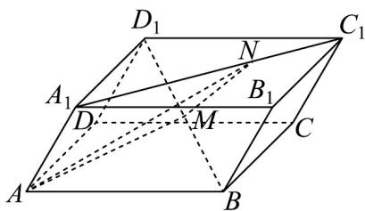

> [!faq]- 《专题1_2_空间向量基本定理_高效培优讲义_》官方解析
>
> > [!success]- **【答案】** 6
>
> > [!note]- **【分析】**
> > 利用向量线性运算，结合几何体特征确定 $MN$ 与 $a, b, c$ 的线性关系，结合空间向量数量积的运算律及
> >
> > 已知条件求 $MN$ 的长度·
>
> > [!note]- **【解析】**
> > 设 $AB = a, AD = b, AA_{1} = c$
> >
> > $$
> > A N = A A _ {1} + A _ {1} N = A A _ {1} + \frac {2}{3} (A _ {1} B _ {1} + A _ {1} D _ {1}) = c + \frac {2}{3} (a + b) = \frac {2}{3} a + \frac {2}{3} b + c
> > $$
> >
> > $$
> > \square \square \square \square = \square \square \square + \frac {1}{2} \square \square \square \square = \square \square \square + \frac {1}{2} (\square \square \square + \square \square \square + \square \square \square) = \frac {1}{2} a + \frac {1}{2} b + \frac {1}{2} c
> > $$
> >
> > $$
> > N M = A M - A N = \left(\frac {1}{2} a + \frac {1}{2} b + \frac {1}{2} c\right) - \left(\frac {2}{3} a + \frac {2}{3} b + c\right) = - \frac {1}{6} a - \frac {1}{6} b - \frac {1}{2} c
> > $$
> >
> > $$
> > \text {所以} \mid N M \mid = \sqrt {\left(- \frac {1}{6} a - \frac {1}{6} b - \frac {1}{2} c\right) ^ {2}} = \sqrt {\frac {1}{3 6} a ^ {2} + \frac {1}{3 6} b ^ {2} + \frac {1}{4} c ^ {2} + \frac {1}{1 8} a b + \frac {1}{6} a c + \frac {1}{6} b c}
> > $$
> >
> > $$
> > = \sqrt {\frac {1}{3 6} \times 4 + \frac {1}{3 6} \times 4 + \frac {1}{4} \times 1 + \frac {1}{6} \times 2 \times 1 \times \frac {1}{2} + \frac {1}{6} \times 2 \times 1 \times \frac {1}{2}} = \frac {\sqrt {2 9}}{6}.
> > $$
> >
> > 所以 $MN = \frac{\sqrt{29}}{6}$
> >
> > 故答案为： $\frac{\sqrt{29}}{6}$
> >
> > 
