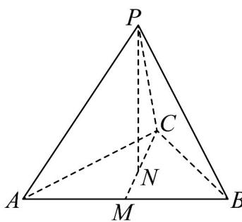

> [!faq]- 《专题1_2_空间向量基本定理_高效培优讲义_》官方解析
>
> > [!success]- **【答案】** D
>
> > [!note]- **【分析】**
> > 设基底为 $PA, PB, PC$ ，选项中涉及到的向量都用基底表示出来，再验证各个选项是否正确。
>
> > [!note]- **【解析】**
> > 设基底为 $\stackrel{\square\square}{PA},\stackrel{\square\square}{PB},\stackrel{\square\square}{PC}$ ，由于四面体 P-ABC 为正四面体，所以可得基底的两两夹角都为 $\frac{\pi}{3}$
> >
> > 对于 A : $BC = PC - PB$ ，∴ $PA \cdot BC = PA \cdot (PC - PB) = PA \cdot PC - PA \cdot PB$
> >
> > $=2\times2\times\frac{1}{2}-2\times2\times\frac{1}{2}=0$ ，故 $^{A}$ 错误；
> >
> > 对于 B： $AB = PB - PA$ ，∴ $PA \cdot AB = PA \cdot (PB - PA) = PA \cdot PB - PA \cdot PA$
> >
> > $=2\times2\times\frac{1}{2}-2\times2=-2$ ，故 $^{B}$ 错误；
> >
> > 对于 C、D：延长 CN 交 AB 于 M，易得 M 为 AB 的中点，由于 N 是 VABC 的中心，可得 $\frac{CN}{CM} = \frac{2}{3}$ .
> >
> > 
> >
> > $$
> > B ^ {\square \square} P N = P C + C N = P C + \frac {2}{3} C M = P C + \frac {2}{3} \cdot \frac {C A + C B}{2} = P C + \frac {1}{3} \cdot \left[ \left(P A - P C\right) + \left(P B - P C\right) \right]
> > $$
> >
> > $= \frac{1}{3} PA + \frac{1}{3} PB + \frac{1}{3} PC$ ，故D正确；
> >
> > 又 $\frac{1}{3} \frac{1}{PB} + \frac{1}{3} \frac{1}{PC} + \frac{1}{3} \frac{1}{PA} = \frac{1}{3} \frac{1}{PB} + \frac{1}{3} \left( \frac{1}{BC} - \frac{1}{BP} \right) + \frac{1}{3} \left( \frac{1}{BA} - \frac{1}{BP} \right) = \frac{1}{3} \frac{1}{BC} + \frac{1}{3} \frac{1}{BA}$ ，故 $C$ 错误。
> >
> > 故选 **D**.
