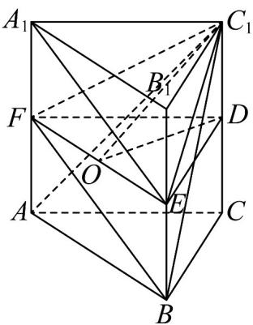

> [!faq]- 《专题1_2_空间向量基本定理_高效培优讲义_》官方解析
>
> > [!success]- **【答案】** ABD
>
> > [!note]- **【分析】**
> > 利用线面平行的判定推理判断 $^{A}$ ；利用空间位置的向量证明判断 $^{B}$ ； $\angle BFC_{1}$ （或其补角）即为直线 $A_{1}E$ 与 $C_{1}F$ 所成的角，由余弦定理求出异面直线夹角余弦判断 $^{C}$ ； $\angle C_{1}OD$ 是平面 $C_{1}EF$ 与平面 DEF 的夹角，
> > 即为平面 $C_{1}EF$ 与平面 ABC 的夹角，利用三角函数关系求出二面角大小判断 D.
>
> > [!note]- **【解析】**
> > 对于 A：依题意， $A_{1}F // BE, A_{1}F = BE$ ，则四边形 $BEA_{1}F$ 为平行四边形，
> >
> > 所以 $A_{1}E//BF$ ，又 $A_{1}E\not\subset$ 平面 $C_{1}BF$ ， $BF\subset$ 平面 $C_{1}BF$ ，故 $A_{1}E//$ 平面 $C_{1}BF$ ，故 A 正确；
> >
> > 对于 B：因为 $AB = AA_{1}$ ，又 $A_{1}E = A_{1}B_{1} + B_{1}E = AB - \frac{1}{2}AA_{1}$ ， $AC_{1} = AC + AA_{1}$
> >
> > 所以 $A_{1}E \cdot AC_{1} = (AB - \frac{1}{2}AA_{1}) \cdot (AC + AA_{1}) = AB \cdot AC + AB \cdot AA_{1} - \frac{1}{2}AA_{1} \cdot AC - \frac{1}{2}AA_{1}^{2}$
> >
> > $$
> > = \left| \overline {{A B}} \right| \cdot \left| \overline {{A C}} \right| \cos 6 0 ^ {\circ} - \frac {1}{2} \left| \overline {{A A _ {1}}} \right| ^ {2} = \frac {1}{2} \left| \overline {{A B}} \right| ^ {2} - \frac {1}{2} \left| \overline {{A A _ {1}}} \right| ^ {2} = 0
> > $$
> >
> > 则 $A_{1}E \perp AC_{1}$ ，故B正确；
> >
> > 对于 C，因为 $A_{1}E//BF$ ，所以 $\angle BFC_{1}$ （或其补角）即为直线 $A_{1}E$ 与 $C_{1}F$ 所成的角，
> >
> > 不妨设 $AB = 1$ ， $AA_{1} = 2$ ，则 $BF = C_1F = \sqrt{2}$ ， $BC_{1} = \sqrt{5}$
> >
> > 故直线 $A_{1}E$ 与 $C_{1}F$ 所成角的余弦值为 $\left|\cos\angle BFC_{1}\right|=\left|\frac{2+2-5}{2\times\sqrt{2}\times\sqrt{2}}\right|=\frac{1}{4}$ ，故 C 错误；
> >
> > 对于 D，取 $CC_{1}$ 的中点 D，连接 DE, DF，则 $\triangle DEF$ 是正三棱柱 $ABC - A_{1}B_{1}C_{1}$ 的中截面，
> >
> > 平面 $DEF / /$ 平面 $ABC$ ，平面 $C_1EF$ 与平面 $ABC$ 的夹角等于平面 $C_1EF$ 与平面 $DEF$ 的夹角，
> >
> > 取 $EF$ 的中点 $O$ ，连接 $C_1O,DO$ ，由 $C_1F = \sqrt{C_1D^2 + DF^2} = \sqrt{C_1D^2 + DE^2} = C_1E$
> >
> > 得 $C_1O \perp EF$ ，又 $DO \perp EF$ ，则 $\angle C_1OD$ 是平面 $C_1EF$ 与平面 $DEF$ 的夹角，
> >
> > 在 Rt $\triangle C_{1}OD$ 中， $\tan\angle C_{1}OD=\frac{C_{1}D}{DO}=\frac{\frac{1}{2}CC_{1}}{\frac{\sqrt{3}}{2}DE}=\frac{\frac{1}{2}AB}{\frac{\sqrt{3}}{2}AB}=\frac{\sqrt{3}}{3}$ ，则 $\angle C_{1}OD=\frac{\pi}{6}$ ，
> >
> > 
> >
> > 所以平面 $C_{1}EF$ 与平面 $ABC$ 的夹角为 $\frac{\pi}{6}$ ，故D正确.
> >
> > 故选 **ABD**
