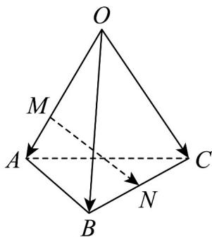

## 题型02 基底的运用

【典例1】如图，在四面体 $OABC$ 中， $\overline{OA} = a$ ， $\overline{OB} = b$ ， $\overline{OC} = c$ 。点 $M$ 在 $OA$ 上，且 $OM = 2MA$ ， $N$ 为 $BC$

中点，则 $MN$ 等于\_\_\_\_。

【答案】 $-\frac{2}{3} a + \frac{1}{2} b + \frac{1}{2} c$

【分析】利用给定的基底，结合空间向量线性运算求出MN·

$MN = MO + OB + BN = -\frac{2}{3}OA + OB + \frac{1}{2}(OC - OB) = -\frac{2}{3}a + \frac{1}{2}b + \frac{1}{2}c.$ 【详解】依题意，

故答案为： $-\frac{2}{3} a + \frac{1}{2} b + \frac{1}{2} c$

## 方法技巧

1. 空间中，任一向量都可以用一组基底表示，且只要基底确定，则表示形式是唯一的。

2.用基底表示空间向量时，一般要结合图形，运用向量加法、减法的平行四边形法则、三角形法则，以及数乘向量的运算法则，逐步向基向量过渡，直至全部用基向量表示.

3. 在空间几何体中选择基底时，通常选取公共起点最集中的向量或关系最明确的向量作为基底，例如，在正方体、长方体、平行六面体、四面体中，一般选用从同一顶点出发的三条棱所对应的向量作为基底。

![[高中/课堂同步/题库/人教A版高中数学同步讲义(2026)/03_选择性必修第一册/第一章 空间向量与立体几何/讲义/专题1_2_空间向量基本定理_高效培优讲义_/题型02_基底的运用_sec_11/questions/Q00062790.md]]
![[高中/课堂同步/题库/人教A版高中数学同步讲义(2026)/03_选择性必修第一册/第一章 空间向量与立体几何/讲义/专题1_2_空间向量基本定理_高效培优讲义_/题型02_基底的运用_sec_11/questions/Q00062791.md]]
![[高中/课堂同步/题库/人教A版高中数学同步讲义(2026)/03_选择性必修第一册/第一章 空间向量与立体几何/讲义/专题1_2_空间向量基本定理_高效培优讲义_/题型02_基底的运用_sec_11/questions/Q00062792.md]]
