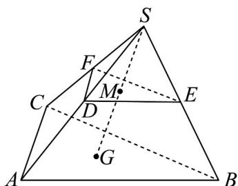

## 题型04 用空间向量基本定理解决相关的几何问题

【典例1】如图，在三棱锥 $S - ABC$ 中，点 $G$ 为底面 $\mathrm{V}ABC$ 的重心，点 $M$ 是线段 $SG$ 的中点，过点 $M$ 的平面

分别交 $SA$ ， $SB$ ， $SC$ 于点 $D$ ， $E$ ， $F$ ，若 $\overline{SD} = k\overline{SA}$ ， $\overline{SE} = m\overline{SB}$ ， $\overline{SF} = n\overline{SC}$ ，则 $\frac{1}{k} +\frac{1}{m} +\frac{1}{n} = (\quad)$

A. 3 B. 6 C. 9 D. 12

【答案】B

【分析】由空间向量基本定理，用 $SA, SB, SC$ 表示 $SM$ ，由 $D, E, F, M$ 四点共面，可得存在实数 $\lambda, \mu$ 使 $\overline{DM} = \lambda \overline{DE} + \mu \overline{DF}$ ，再转化为 $\overline{SM} = (1 - \lambda - \mu) k \overline{SA} + \lambda m \overline{SB} + \mu n \overline{SC}$ ，由空间向量分解的唯一性，列方程求

其解可得结论·

【详解】由题意可知，

$$
\stackrel {\square \square \square} {S M} = \frac {1}{2} \stackrel {\square \square \square} {S G} = \frac {1}{2} \left(\stackrel {\square \square} {S A} + \stackrel {\square \square \square} {A G}\right) = \frac {1}{2} \left[ \stackrel {\square \square} {S A} + \frac {2}{3} \times \frac {1}{2} \left(\stackrel {\square \square \square} {A B} + \stackrel {\square \square \square} {A C}\right) \right]
$$

$$
= \frac {1}{2} \left[ \stackrel {\square \square} {S A} + \frac {1}{3} \left(\stackrel {\square \square} {S B} - \stackrel {\square \square} {S A}\right) + \frac {1}{3} \left(\stackrel {\square \square \square} {S C} - \stackrel {\square \square} {S A}\right) \right] = \frac {1}{6} \stackrel {\square \square} {S A} + \frac {1}{6} \stackrel {\square \square} {S B} + \frac {1}{6} \stackrel {\square \square \square} {S C}
$$

因为 $D$ ， $E$ ， $F$ ， $M$ 四点共面，

所以存在实数 $\lambda, \mu$ ，使 $DM = \lambda DE + \mu DF$

所以 $\overline{SM} -\overline{SD} = \lambda \left(\overline{SE} -\overline{SD}\right) + \mu \left(\overline{SF} -\overline{SD}\right)$

所以

$$
\stackrel {\square \square \square} {S M} = (1 - \lambda - \mu) \stackrel {\square \square \square} {S D} + \lambda \stackrel {\square \square} {S E} + \mu \stackrel {\square \square \square} {S F} = (1 - \lambda - \mu) k \stackrel {\square \square} {S A} + \lambda m \stackrel {\square \square} {S B} + \mu n \stackrel {\square \square \square} {S C}
$$

所以

$$
\left\{ \begin{array}{l} (1 - \lambda - \mu) k = \frac {1}{6} \\ \lambda m = \frac {1}{6} \\ \mu n = \frac {1}{6} \end{array} \right.
$$

，所以

$$
\frac {1}{k} + \frac {1}{m} + \frac {1}{n} = 6 (1 - \lambda - \mu) + 6 \lambda + 6 \mu = 6
$$

故选：B.

## 方法技巧

应用空间向量基本定理可以证明空间的线线垂直、线线平行,可求两条异面直线所成的角等.

首先根据几何体的特点,选择一个基底,把题目中涉及的两条直线所在的向量用基向量表示.

(1)若证明线线垂直,只需证明两向量数量积为0;

(2)若证明线线平行,只需证明两向量共线;

(3)若要求异面直线所成的角,则转化为两向量的夹角(或其补角).

![[高中/课堂同步/题库/人教A版高中数学同步讲义(2026)/03_选择性必修第一册/第一章 空间向量与立体几何/讲义/专题1_2_空间向量基本定理_高效培优讲义_/_compact/Q00062796.md]]
![[高中/课堂同步/题库/人教A版高中数学同步讲义(2026)/03_选择性必修第一册/第一章 空间向量与立体几何/讲义/专题1_2_空间向量基本定理_高效培优讲义_/_compact/Q00062797.md]]
![[高中/课堂同步/题库/人教A版高中数学同步讲义(2026)/03_选择性必修第一册/第一章 空间向量与立体几何/讲义/专题1_2_空间向量基本定理_高效培优讲义_/_compact/Q00062798.md]]
