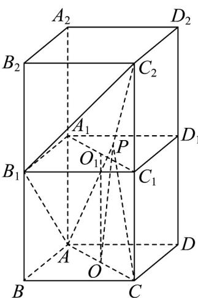

> [!faq]- 《专题1_3_空间向量及其运算的坐标表示_高效培优讲义_》官方解析
>
> > [!success]- **【答案】** ACD
>
> > [!note]- **【分析】**
> > 设 A, B, C, D 关于平面 $A_{1}B_{1}C_{1}D_{1}$ 的对称点分别为 $A_{2}, B_{2}, C_{2}, D_{2}$ ，底面 ABCD 和 $A_{1}B_{1}C_{1}D_{1}$ 的中心分别为 $O, O_{1}$ ，作出图形，由当 $^{P}$ 与 $^{O_{1}}$ 重合时，可得 AD；由对称性可得 $^{C}$ 正确，由当 $^{P}$ 与 $^{B_{1}}$ 重合时可得 B 错误。
>
> > [!note]- **【解析】**
> > 
> >
> > 设 $A, B, C, D$ 关于平面 $A_{1}B_{1}C_{1}D_{1}$ 的对称点分别为 $A_{2}, B_{2}, C_{2}, D_{2}$ ，底面 $ABCD$ 和 $A_{1}B_{1}C_{1}D_{1}$ 的中心分别为 $O, O_{1}$ ，如
> >
> > 图所示：
> >
> > 对于 $A$ ，易知 $O$ 为 $AC$ 的中点，则 $\overline{PO} = \frac{1}{2}\left(\overline{PA} +\overline{PC}\right)$ ，可得 $\overline{PA} +\overline{PC} = 2\overline{PO}$
> >
> > 所以 $\left|\overline{PA}+\overline{PC}\right|=2\left|\overline{PO}\right|$
> >
> > 当 $P$ 与 $O_{1}$ 重合时， $OO_{1} \perp$ 底面 $ABCD$ ，此时 $\left|PO\right|$ 取得最小值为 $1$ ，即 $PA + P\bar{C}$ 的最小值为 $2$ ，故 $A$ 正确；
> >
> > 对于 D， $\left|PA\right|^{2}+\left|PC\right|^{2}=\left|PO+OA\right|^{2}+\left|PO+OC\right|^{2}=\left|PO+OA\right|^{2}+\left|PO-OA\right|^{2}$
> >
> > $$
> > = 2 \left(\left| P O \right| ^ {2} + \left| O A \right| ^ {2}\right) = 2 \left| P O \right| ^ {2} + 2 \left| O A \right| ^ {2} = 2 \left| P O \right| ^ {2} + 2 \times \left(\frac {\sqrt {2}}{2}\right) ^ {2} = 2 \left| P O \right| ^ {2} + 1
> > $$
> >
> > 当 $P$ 与 $O_{1}$ 重合时， $OO_{1} \perp$ 底面ABCD，此时 $\left|\overline{PO}\right|$ 取得最小值为1，则 $\left|\overline{PA}\right|^2 + \left|\overline{PC}\right|^2$ 的最小值为3，故D正确；
> >
> > 对于 B，当 P 与 $B_{1}$ 重合时， $\overline{P}A\overline{1}+\overline{P}C=\overline{P}A\overline{1}+\overline{PC}_{2}=\left|AB_{1}\right|+\left|C_{2}B_{1}\right|=2\sqrt{2}>1+\sqrt{3}$ ，故 B 错误；
> >
> > 对于 $C$ ，由对称性可知， $\overline{PQ} = \left|\overline{PC}_2\right|$ ，则 $\left|\overline{PA}\right| + \left|\overline{PC}\right| = \left|\overline{PA}\right| + \left|\overline{PC}_2\right|$ $\left|AC_2\right| = \sqrt{\left|AC_2\right|^2 + \left|CC_2\right|^2} = \sqrt{2 + 4} = \sqrt{6}$
> >
> > 当且仅当点 P 为线段 $AC_{2}$ 与平面 $A_{1}B_{1}C_{1}D_{1}$ 的交点时， $\left|\overline{PA}\right|+\left|\overline{PC}\right|$ 的最小值为 $\sqrt{6}$ ，故 C 正确.
> >
> > 故选 **ACD**.
