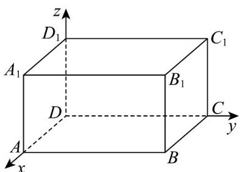

<!-- question-source:start -->
8. 如图，在长方体 $ABCD - A_1B_1C_1D_1$ 中， $AB = 5$ ， $AD = 4$ ， $AA_1 = 3$ ，分别以有向直线 $DA, DC, DD_1$ 为 $x$ 轴， $y$ 轴， $z$ 的正方向，以 $1$ 为单位长度，建立空间直角坐标系，则下列说法正确的是（）

A. 点 $B_{1}$ 的坐标为 $(4,5,3)$ B. 点 $C_1$ 关于点 $B$ 对称的点为 $(5,8,-3)$ C. 点A关于直线 $BD_{1}$ 对称的点为 $(0,5,3)$ D. 点 $C$ 关于平面 $ABB_{1}A_{1}$ 对称的点为 $(8,5,0)$
<!-- question-source:end -->

![[高中/课堂同步/题库/人教A版高中数学同步讲义(2026)/03_选择性必修第一册/第一章 空间向量与立体几何/讲义/专题1_3_空间向量及其运算的坐标表示_高效培优讲义_/强化训练_sec_15/questions/answers/Q00062841A1.md]]
