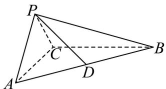

<!-- question-source:start -->
1. 在三棱锥 $P - ABC$ 中， $AC \perp BC$ ， $AP \perp CP$ ， $AP = CP = 2$ ， $D$ 是 $AB$ 的中点，且平面 $PAC \perp$ 平面 $ABC$ .

(1)证明： $AP\bot$ 平面 $BCP$ ；

(2)已知平面 $\alpha$ 经过直线 $PC$ ，且 $AB // \alpha$ ，直线 $PD$ 与平面 $\alpha$ 所成角的正弦值为 $\overline{3}$ ，求三棱锥 $P - ABC$ 的体积·

$$
\frac {\sqrt {6}}{3}
$$
<!-- question-source:end -->

![[高中/课堂同步/题库/人教A版高中数学同步讲义(2026)/03_选择性必修第一册/第一章 空间向量与立体几何/讲义/专题1_4_空间向量的应用_高效培优讲义_/即学即练_sec_08/questions/answers/Q00062851A1.md]]
