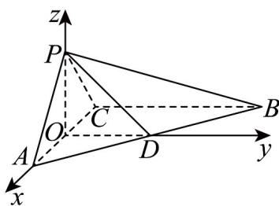

> [!faq]- 《专题1_4_空间向量的应用_高效培优讲义_》官方解析
>
> > [!success]- **【答案】** (1)证明见解析 (2) $\frac{4}{3}$ 或 $\frac{4}{3}\sqrt{2}$
>
> > [!note]- **【分析】**
> > （1）由平面 $PAC \perp$ 平面 ABC，得到 $BC \perp$ 平面 PAC，再结合 $AP \perp CP$ 即可求证；
> >
> > (2) 建系，设 $BC = 2m$ 求得平面法向量及直线方向向量，代入夹角公式即可求解 $m$ ，利用体积公式计计算
> >
> > 得出结果·
>
> > [!note]- **【解析】**
> > （1）因为平面 $PAC \perp$ 平面 $ABC$ ，平面 $PAC \cap$ 平面 $ABC = AC, BC \subset$ 平面 $ABC, AC \perp BC$
> >
> > 所以 $BC \perp$ 平面 PAC .
> >
> > 又 $AP \subset$ 平面 $PAC$ ，所以 $BC \perp AP$ 。
> >
> > 又 $AP \perp CP, BC, CP \subset$ 平面 $BCP, BC \cap CP = C$
> >
> > 所以 $AP \perp$ 平面 BCP .
> >
> > (2) 记 AC 的中点为 O，连接 PO,DO
> >
> > 因为 $AP = CP$ ，所以 $PO \perp AC$
> >
> > 因为平面 $PAC \perp$ 平面 ABC ，所以 $PO \perp$ 平面 ABC .
> >
> > 因为 O, D 分别是 AC, AB 的中点，所以 $OD \parallel BC$ ，又 $BC \perp AC$ ，所以 $OD \perp AC$ 。
> >
> > 以 O 为坐标原点，OA,OD,OP 所在直线分别为 x,y,z 轴，建立如图所示的空间直角坐标系
> >
> > 设 $BC = 2m$ ，则 $A\left(\sqrt{2},0,0\right),B\left(-\sqrt{2},2m,0\right),C\left(-\sqrt{2},0,0\right),P\left(0,0,\sqrt{2}\right),D\left(0,m,0\right)$
> >
> > 所以 $\overline{PD}=\left(0,m,-\sqrt{2}\right),\overline{CP}=\left(\sqrt{2},0,\sqrt{2}\right),\overline{AB}=\left(-2\sqrt{2},2m,0\right)$
> >
> > 由题知 $AB / / \alpha, PC \subset \alpha$ ，设平面 $\alpha$ 的法向量为 $n = (x, y, z)$
> >
> > 则 $\left\{ \begin{array}{l} n \cdot \overline{CP} = 0, \\ n \cdot AB = 0, \end{array} \right.$ 即 $\left\{ \begin{array}{l} \sqrt{2} x + \sqrt{2} z = 0, \\ -2\sqrt{2} x + 2my = 0, \end{array} \right.$ 令 $x = m$ ，则 $y = \sqrt{2}, z = -m$ ，则 $n = (m, \sqrt{2}, -m)$ .
> >
> > 则 $\left|\cos\vec{P}PD,n\vec{P}\right|=\frac{\left|\overrightarrow{PD}\cdot n\right|}{\left|PD\right|\left|n\right|}=\frac{2\sqrt{2}m}{\sqrt{m^{2}+2}\times\sqrt{2m^{2}+2}}=\frac{\sqrt{6}}{3}$
> >
> > 化简可得 $m^{4}-3m^{2}+2=0$ ，解得 m=1 或 $m=\sqrt{2}$ ，
> >
> > 三棱锥 $P - ABC$ 的体积 $V = \frac{1}{3} PO \cdot S_{\triangle ABC} = \frac{4}{3} m$ ，所以体积为 $\frac{4}{3}$ 或 $\frac{4}{3}\sqrt{2}$
> >
> > 
