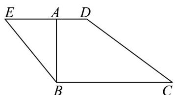
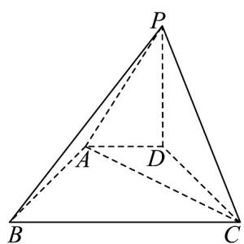

<!-- question-source:start -->
13．如图1所示，四边形BCDE满足 $BC\parallel DE$ ，过点B作 $BA\perp DE$ ，点A在线段DE上，且满足

$BC = \sqrt{3} AB = 3AD = 3$ ，将 $\triangle ABE$ 沿直线 $AB$ 翻折到 $\triangle PAB$ 的位置（图2）， $PB\bot AC$

(1)求证： $AB\bot PD$

(2)若 $PD = 2$ ，求平面 $PBC$ 与平面 $ABCD$ 夹角的余弦值
<!-- question-source:end -->

![[高中/课堂同步/题库/人教A版高中数学同步讲义(2026)/03_选择性必修第一册/第一章 空间向量与立体几何/讲义/专题1_4_空间向量的应用_高效培优讲义_/强化训练_sec_15/questions/answers/Q00062887A1.md]]
