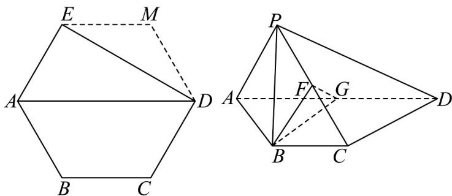

<!-- question-source:start -->
14．如图所示，五边形 $ABCDE$ 是正六边形 $ABCDME$ 的一部分，将VADE沿着对角线AD翻折到△ADP的位置，

使平面 $ADP \perp$ 平面 $ABCD$ ，已知点 $F, G$ 分别为 $PC$ ， $AD$ 的中点。

(1)求证： $AP / /$ 平面BFG；

(2)求平面 BFG 与平面 PAD 所成二面角的正弦值.
<!-- question-source:end -->

![[高中/课堂同步/题库/人教A版高中数学同步讲义(2026)/03_选择性必修第一册/第一章 空间向量与立体几何/讲义/专题1_4_空间向量的应用_高效培优讲义_/强化训练_sec_15/questions/answers/Q00062888A1.md]]
