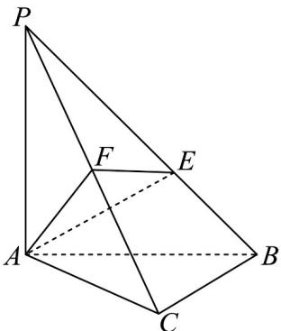

<!-- question-source:start -->
15. 如图，在三棱锥 $P - ABC$ 中， $AC \perp BC$ ， $AC = BC = 3\sqrt{2}$ ， $PA \perp$ 平面 $ABC$ .

(1)求证：平面 $PBC \perp$ 平面 $PAC$ ；

$$
\sqrt {7}
$$

(2)若 $AP = AB$ ， $F$ 为线段 $PC$ 的中点，点 $E$ 为线段 $PB$ 的动点，且二面角 $E - AF - C$ 的余弦值为 $\overline{7}$ ，求 $BE\cdot$
<!-- question-source:end -->

![[高中/课堂同步/题库/人教A版高中数学同步讲义(2026)/03_选择性必修第一册/第一章 空间向量与立体几何/讲义/专题1_4_空间向量的应用_高效培优讲义_/强化训练_sec_15/questions/answers/Q00062889A1.md]]
