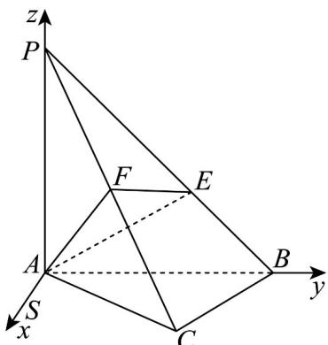

> [!faq]- 《专题1_4_空间向量的应用_高效培优讲义_》官方解析
>
> > [!success]- **【答案】** $^{(1)}$ 证明见解析 (2) $BE = 2\sqrt{2}$
>
> > [!note]- **【分析】**
> > （1）根据线面垂直的性质定理得 $PA \perp BC$ ，则利用线面垂直的判断定理得 $BC \perp$ 平面PAC，进而利
> >
> > 用面面垂直的判定定理正解即可·
> >
> > (2) $BC \perp$ 平面 $PAC$ ，建立空间直角坐标系，求出平面 $AEF$ 和平面 $PAC$ 的法向量，利用向量法求出 $\lambda = 3$
> >
> > 可得 $\overline{BE} = (0, -2, 2)$ ，即可得解·
>
> > [!note]- **【解析】**
> > （1）∵ PA ⊥ 平面 ABC，BC ⊂ 平面 ABC，∴ PA ⊥ BC，
> >
> > 又∵ $AC \perp BC$ ， $PA \cap AC = A$ ， $PA, AC \subset$ 平面 PAC
> >
> > $\therefore BC \perp$ 平面 PAC， $BC \subset$ 平面 PBC，
> >
> > ∴平面 $PBC \perp$ 平面 PAC.
> >
> > (2) 过 A 在平面 ABC 内作 $AS \perp AB$
> >
> > 以 A 为原点，以 AS ， AB ， AP 为 x 轴、 y 轴、 z 轴建立空间直角坐标系，如图
> >
> > 
> >
> > $\because AC \perp BC, AC = BC = 3\sqrt{2}, \therefore AB = AP = 6$
> >
> > $\therefore C(3,3,0)$ ， $B(0,6,0)$ ， $P(0,0,6)$ ， $\because F$ 为PC中点，∴
> >
> > 设 $\overline{BP}=\lambda\overline{BE}$ ， $\overline{AE}=\overline{AB}+\overline{BE}=(0,6,0)+\frac{1}{\lambda}(0,-6,6)=\left(0,6\left(1-\frac{1}{\lambda}\right),\frac{6}{\lambda}\right)$
> >
> > 设平面 $AEF$ 的法向量为 $n = (x, y, z)$
> >
> > $$
> > \left[ \begin{array}{l} \square \square \square \\ A F \cdot n = \frac {3}{2} x + \frac {3}{2} y + 3 z = 0 \end{array} \right.
> > $$
> >
> > $$
> > \therefore \left\{\begin{array}{l}\overrightarrow {\square \square \square} \rightarrow\\A E \cdot n = 6 y \left(1 - \frac {1}{\lambda}\right) + \frac {6 z}{\lambda} = 0\end{array}, \right.
> > $$
> >
> > 令 $y = 1$ ， $x = 2\lambda -3$ ， $z = 1 - \lambda$ ，即 $n = (2\lambda -3,1,1 - \lambda)$
> >
> > 由（1）知 $BC \perp$ 平面 $PAC$ ， $\therefore BC = (3, -3, 0)$ 为平面 $PAC$ 的一个法向量，
> >
> > 设平面 PAC 与平面 AEF 所成角为 $\theta$ ，
> >
> > $$
> > \cos \theta = \left| \cos B C, n \right| = \frac {\left| \overrightarrow {B C} . n \right|}{\left| B C \right| | n |} = \left| \frac {6 \lambda - 1 2}{3 \sqrt {2} \sqrt {5 \lambda^ {2} - 1 4 \lambda + 1 1}} \right| = \frac {\sqrt {7}}{7},
> > $$
> >
> > 解得 $\lambda=3$ 或 $\lambda=\frac{5}{3}$ ，
> >
> > 由（1）知，当 $E$ 为 $PB$ 中点即 $\lambda = 2$ 时 $EF \parallel BC$ ， $\therefore EF \perp$ 平面 $AEF$
> >
> > 又∵二面角 E-AF-C 的余弦值为 $\frac{\sqrt{7}}{7}$ ，∴二面角 E-AF-C 为锐角，
> >
> > $\therefore \lambda > 2 \therefore \lambda = 3, \therefore AE = \left(0, 6\left(1 - \frac{1}{\lambda}\right), \frac{6}{\lambda}\right) = (0, 4, 2)$
> >
> > $$
> > \begin{array}{l} \square \square \square \\ B E = A E - A B = (0, - 2, 2) \\ \therefore \end{array} , \quad \therefore B E = 2 \sqrt {2}.
> > $$
