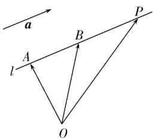

## 知识点 01 直线的方向向量和平面的法向量

## 1. 直线的方向向量：

$$
A B = a
$$

点 $A$ 是直线 $l$ 上的一个点， $a$ 是直线 $l$ 的方向向量，在直线 $l$ 上取 $AB = a$ ，取定空间中的任意一点 $O$ ，则点 $P$

在直线 l 上的充要条件是存在实数 t，使 $OP = OA + ta$ 或 $OP = OA + tAB$ ，这就是空间直线的向量表达式.

## 2. 平面的法向量定义：

直线 $l \perp \alpha$ ，取直线 $l$ 的方向向量 $a$ ，我们称向量 $a$ 为平面 $\alpha$ 的法向量。给定一个点 $A$ 和一个向量 $a$ ，那么过点

A，且以向量 a 为法向量的平面完全确定，可以表示为集合 $\left\{P \mid a \cdot AP = 0\right\}$ .

3. 平面的法向量确定通常有两种方法：

（1）几何体中有具体的直线与平面垂直，只需证明线面垂直，取该垂线的方向向量即得平面的法向量；

(2) 几何体中没有具体的直线，一般要建立空间直角坐标系，然后用待定系数法求解，一般步骤如下：

(i) 设出平面的法向量为 $n = (x, y, z)$ ;

(ii) 找出（求出）平面内的两个不共线的向量的坐标 $a = (a_{1}, b_{1}, c_{1})$ ， $b = (a_{2}, b_{2}, c_{2})$ ;

(iii) 根据法向量的定义建立关于 $x$ 、 $y$ 、 $z$ 的方程 $\left\{ \begin{array}{l} n \cdot \underline{a} = 0 \\ n \cdot b = 0 \end{array} \right.$ ;

(iv) 解方程组，取其中的一个解，即得法向量。由于一个平面的法向量有无数个，故可在代入方程组的解

中取一个最简单的作为平面的法向量.
