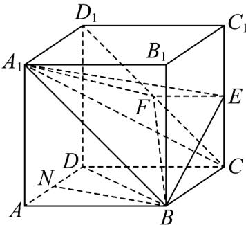

## 知识点 02 用向量方法判定空间中的平行关系

空间中的平行关系主要是指：线线平行、线面平行、面面平行。

(1) 线线平行设直线 $l_{1}, l_{2}$ 的方向向量分别是 $a, b$ ，则要证明 $l_{1} // l_{2}$ ，只需证明 $a // b$ ，即 $a = kb (k \in \mathbf{R})$

(2) 线面平行 线面平行的判定方法一般有三种：

①设直线 $l$ 的方向向量是 $a$ ，平面 $\alpha$ 的向量是 $u$ ，则要证明 $l / / \alpha$ ，只需证明 $a \perp u$ ，即 $a \cdot u = 0$ ：

② 根据线面平行的判定定理：要证明一条直线和一个平面平行，可以在平面内找一个向量与已知直线的方向

向量是共线向量.

③根据共面向量定理可知，要证明一条直线和一个平面平行，只要证明这条直线的方向向量能够用平面内两

个不共线向量线性表示即可.

(3) 面面平行①由面面平行的判定定理，要证明面面平行，只要转化为相应的线面平行、线线平行即可.

②若能求出平面 $\alpha$ ， $\beta$ 的法向量 $u, v$ ，则要证明 $\alpha // \beta$ ，只需证明 $u // v$ 。

【即学即练】

1. 在直四棱柱 $ABCD - A_{1}B_{1}C_{1}D_{1}$ 中，底面 $ABCD$ 是菱形， $\angle BAD = \frac{\pi}{3}$ ， $AB = AA_{1} = 2$ ， $E$ 为 $CC_{1}$ 的中点，点 $F$

满足 $\stackrel{\square\square\square\square}{DF}=\lambda\stackrel{\square\square\square\square}{DC}+\mu\stackrel{\square\square\square\square\square}{DD_{1}}$ ， $\lambda\in[0,1]$ ， $\mu\in[0,1]$ ，下列结论正确的是（）

A. 若 $\lambda = 1$ ，则 $AF \perp BD$

B．若 $\lambda + \mu = 1$ ，则四面体 $A_{1} - BEF$ 的体积是定值

C．若 $\lambda=1,\quad\mu=\frac{1}{2}$ ，则存在点 $P\in A_{1}B$ ，使得 $AP+PF$ 的最小值为 $9+2\sqrt{10}$

D．若 $B_{1}F\perp EF$ ，则点F的轨迹长为 $\frac{\sqrt{2}}{2}\pi$

【答案】ABD

【分析】若 $\lambda=1$ ，则 F 在 $CC_{1}$ 上，利用线面垂直的判定定理、性质定理可判断 A；若 $\lambda+\mu=1$ ，则 F, C, $D_{1}$ 三

点共线，利用线面平行的判定定理得出 $CD_{1} / /$ 平面 $A_{1}BE$ ，得 $CD_{1}$ 上的点到平面 $A_{1}BE$ 的距离都相等，再由

$V_{A_1 - BEF} = V_{F - A_1BE} = V_{C - A_1BE} = V_{A_1 - BCE}$ ，可判断B；若 $\lambda = 1$ ， $\mu = \frac{1}{2}$ ，则点 $F$ 与 $E$ 点重合，把 $\triangle A_1AB$ 沿着 $A_{1}B$ 进行

翻折，使得 $A_{1}, A, B_{1}, F$ 四点共面，此时 $AP + PF$ 有最小值 $AF$ ，由余弦定理可判断 ${}^{\mathsf{C}}$ ；取 $AB$ 的中点 $G$ ，以 $D$

为原点，分别以 $DG, DC, DD_{1}$ 所在的直线为 $x, y, z$ 轴建立空间直角坐标系，设 $F(0, y, z)$ 利用 $\overline{B}_{1}F \cdot EF = 0$ 可判

断 $^{D}$ 正确·

【详解】对于 A，若 $\lambda=1$ ，则 $\overline{DF}-\overline{DC}=\overline{CF}=\mu\overline{DD}_{1}$ ，即 F 在 $CC_{1}$ 上，

连接 AF, BD, AC，因为底面 ABCD 是菱形，所以 $AC \perp BD$

因为 $CC_{1} \perp$ 底面ABCD， $BD \subset$ 平面ABCD，所以 $CC_{1} \perp BD$

又 $AC \cap CC_{1} = C$ ， $AC, CC_{1} \subset$ 平面 $ACF$ ，所以 $BD \perp$ 平面 $ACF$

$AF \subset$ 平面 $ACF$ ，所以 $AF \perp BD$ ，故 $^{A}$ 正确；

对于 B，若 $\lambda + \mu = 1$ ，则 F, C, $D_{1}$ 三点共线，连接 $CD_{1}, A_{1}F, BF, EF, A_{1}C$

因为 $A_{1}D_{1}//BC, A_{1}D_{1}=BC$ ，所以四边形 $A_{1}D_{1}CB$ 是平行四边形， $A_{1}B//CD_{1}$

因为 $CD_{1} \not\subset$ 平面 $A_{1}BE$ ， $A_{1}B \subset$ 平面 $A_{1}BE$ ，所以 $CD_{1} //$ 平面 $A_{1}BE$ ，

可得 $CD_{1}$ 上的点到平面 $A_{1}BE$ 的距离都相等，

可得 $V_{A_1 - BEF} = V_{F - A_1BE} = V_{C - A_1BE} = V_{A_1 - BCE}$ ，取 $AD$ 的中点 $N$ ，连接 $BN,BD$

可得 $\triangle ABD$ 是边长为 $2$ 的等边三角形， $BN \perp AD$

又 $A_{1}A \perp$ 平面ABCD， $BN \subset$ 平面ABCD，所以 $A_{1}A \perp BN$ ，又 $A_{1}A \cap AD = A$

$A_{1}A, AD \subset A_{1}D_{1}DA$ 平面，可得 $BN \perp$ 平面 $A_{1}D_{1}DA$

$BN \perp$ 平面 $B_{1}C_{1}CB$ ，因为 $S_{\triangle BCE} = \frac{1}{2} BC \times CE = 1$ ，

$V_{A_{1}-BCE}=\frac{1}{3}S_{\triangle BCE}\times BN=\frac{1}{2}\times\sqrt{3}=\frac{\sqrt{3}}{2}$ ，可得 $V_{A_{1}-BEF}=\frac{\sqrt{3}}{2}$ ，故 $^{B}$ 正确；

对于 C，若 $\lambda=1$ ， $\mu=\frac{1}{2}$ ，则 $\overline{DF}=\overline{DC}+\frac{1}{2}\overline{DD}_{1}$ ，即 $\overline{DF}-\overline{DC}=\overline{CF}=\frac{1}{2}\overline{DD}_{1}$

即点 $F$ 与 $E$ 点重合，把 $\triangle A_{1}AB$ 沿着 $A_{1}B$ 进行翻折，使得 $A_{1}, A, B_{1}, F$ 四点共面，

此时 $AP + PF$ 有最小值 $AF$ ，在 $\triangle A_{1}FB$ 中， $A_{1}A = \sqrt{13}, BF = \sqrt{5}, A_{1}B = 2\sqrt{2}$

所以 $A_{1}F^{2} = A_{1}B^{2} + BF^{2}$ ，所以 $\angle A_1BF = \frac{\pi}{2}$ ，所以 $\angle ABF = \frac{3\pi}{4}$

在 $\triangle AFB$ 中，由余弦定理得 $\cos \angle ABF = \frac{AB^2 + BF^2 - AF^2}{2AB\times BF} = \frac{4 + 5 - AF^2}{4\sqrt{5}} = -\frac{\sqrt{2}}{2}$

解得 $AF = \sqrt{9 + 2\sqrt{10}}$ ，故 C 错误；

对于 $\mathsf{D}$ ，取 $AB$ 的中点 $G$ ，连接 $DG$ ， $AD = 2, AG = 1, \angle DAB = \frac{\pi}{3}$

由余弦定理得 $DG = \sqrt{3}$ ，则 $DG \perp AB$ ，以 $D$ 为原点，分别以 $DG, DC, DD_{1}$ 所在的直线为 $x, y, z$ 轴建立空间直角坐标系，设 $F(0, y, z)$ ， $B_1(\sqrt{3}, 1, 2), E(0, 2, 1)$ ， $B_1F = (-\sqrt{3}, y - 1, z - 2), EF = (0, y - 2, z - 1)$ ，因为 $B_1F \perp EF$ ，所以 $B_1F \cdot EF = (y - 1)(y - 2) + (z - 1)(z - 2) = 0$ ，即 $\left(y - \frac{3}{2}\right)^2 + \left(z - \frac{3}{2}\right)^2 = \frac{1}{2}$ ，可得点 $F$ 的轨迹是在平面 $DCC_1D_1$ 内，以 $\left(0, \frac{3}{2}, \frac{3}{2}\right)$ 为圆心， $\frac{\sqrt{2}}{2}$ 为半径的半圆，且 $C_1K = C_1M = \frac{1}{2}$ ，所以点 $F$ 的轨迹长为 $2\pi \times \frac{\sqrt{2}}{2} \times \frac{1}{2} = \frac{\sqrt{2}}{2}\pi$ ，故 D 正确。

故选：ABD.

2. 已知点 $A(1,0,1)$ ，点 $B(3,4,-1)$ ，平面 $\alpha$ 的一个法向量为 $n = (1,2,-1)$ ，则直线 $AB$ 与平面 $\alpha$ 的关系是（）
A. $AB \perp \alpha$ B. $AB \subset \alpha$ C. $AB // \alpha$ D. $AB$ 与 $\alpha$ 相交但不垂直

【答案】A
【分析】根据平面 $\alpha$ 的法向量与直线 AB 的方向向量的关系即可求解
【详解】因为直线 l 经过点 $A(1,0,1), B(3,4,-1)$ ，
所以 $\overline{AB} = (2, 4, -2)$ ，又因为平面 $\alpha$ 的一个法向量为 $n = (1, 2, -1)$ ，

且 $2n = AB$ ，所以平面 $\alpha$ 的一个法向量与直线 $l$ 的方向向量平行，

则 $l \perp \alpha$ ， $AB \perp \alpha$ ；

故选：A.
