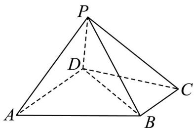
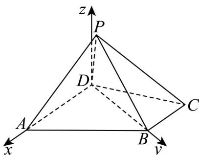

## 知识点 03 用向量方法判定空间的垂直关系

空间中的垂直关系主要是指：线线垂直、线面垂直、面面垂直。

(1) 线线垂直设直线 $l_{1}, l_{2}$ 的方向向量分别为 $a, b$ ，则要证明 $l_{1} \perp l_{2}$ ，只需证明 $a \perp b$ ，即 $a \cdot b = 0$

(2) 线面垂直①设直线 $l$ 的方向向量是 $a$ ，平面 $\alpha$ 的向量是 $u$ ，则要证明 $l \perp \alpha$ ，只需证明 $a // u$ 。

②根据线面垂直的判定定理转化为直线与平面内的两条相交直线垂直.

## (3) 面面垂直

①根据面面垂直的判定定理转化为证相应的线面垂直、线线垂直．②证明两个平面的法向量互相垂直．

【即学即练】

1. 已知平面 $\alpha$ 的法向量为 $n = (1,2,-1), AB = (2,4-2)$ ，则直线 $AB$ 和平面 $\alpha$ 的位置关系是（ ）A. $AB \perp \alpha$ B. $AB // \alpha$ C. $AB \subset \alpha$ D. $AB$ 与 $\alpha$ 相交但不垂直

【答案】A

【分析】得出 $AB//n$ ，即可判断·

【详解】由题意得， $AB=2n$ ，则 $AB//n$ ，则 $AB\perp\alpha$ 。

故选：A

2．如图，四棱锥 P-ABCD 中，BC//AD，AD=CD=2BC=2，平面 PAD⊥平面 PBC.

(1)若 $PB \perp BC$ ，证明： $AP \perp BP$ ；

(2)若 $PA \perp PC$ ， $\angle BCD = \frac{\pi}{3}$ ，求 $PA$ 长度的取值范围.

【答案】(1)证明见详解；

(2) $(0,\sqrt{3})\cup(3,2\sqrt{3})$ .

【分析】（1）通过证明 $PB$ 垂直平面 $PAD$ 与平面 $PBC$ 的交线，利用平面与平面垂直的性质定理来证明线面

垂直，再利用线面垂直的性质定理证得两直线垂直；

(2) 建立空间直角坐标系，将垂直关系、线段长度都转化成坐标运算，设 $P(a,b,c)$ ，通过 $PA \perp PC$ 解得 a = 2

或-1，分别代入计算可得结果·

【详解】（1）设平面 $ADP \cap$ 平面 BCP = l，

∵ BC ∥ AD, AD ⊂ ADP, BC ∉ 平面 ADP, ∴ BC ∥ 平面 ADP

又∵ $BC \subset$ 平面 BCP ，平面 $ADP \cap$ 平面 BCP = l ，∴ $BC \parallel l$

$$
\because P B \perp B C, B C \parallel l \quad \therefore P B \perp l
$$

又∵平面 $ADP \perp$ 平面 BCP ，平面 $ADP \cap$ 平面 $BCP = l, PB \subset$ 平面 BCP ，

$\therefore PB \perp$ 平面 ADP

又∵ $AP \subset$ 平面 ADP ，

$$
\therefore P B \perp A P _ {\text {即}} A P \perp B P.
$$

(2) 在 $\triangle BCD$ 中由余弦定理可得 $BD = \sqrt{3}$ ，则有 $BD^{2} + BC^{2} = CD^{2}$ ，

$$
\therefore \angle C B D = \frac {\pi}{2}, _ {\text {即}} D B \perp B C.
$$

又∵ BC // AD, ∴ DB ⊥ AD.

以点 D 为原点，以 DA, DB，平面 ABCD 的垂线所在直线分别为 x, y, z 轴，建立如图坐标系，则 $A(2,0,0), B(0,\sqrt{3},0), C(-1,\sqrt{3},0)$

设 $P(a,b,c)$ ，则 $DP=(a,b,c)$ ， $DA=(2,0,0)$ ，

设平面 PAD 的一个法向量为 $n_{1}=(x,y,z)$

则 $\left\{ \begin{array}{l} n_{1} \cdot D A = 0 \\ n_{1} \cdot DP = 0 \end{array} \right.$ ，即 $\left\{ \begin{array}{l} 2x = 0 \\ ax + by + cz = 0 \end{array} \right.$ ，令 $y = c$ ，则 $n_{1}^{u} = (0, c, -b)$ .

同理可求平面 $PBC$ 的一个法向量为 $\overline{n_2} = (0, c, \sqrt{3} - b)$

由于平面 $PAD \perp$ 平面 $PBC$ ，则 $n_1 \cdot n_2 = 0$ ，故 $c^2 + b(b - \sqrt{3}) = 0$ ，则 $b \in (0, \sqrt{3})$ .

又∵ $PA \perp PC$ ， $\overset{\sqcup\sqcup\sqcup}{PA} = (2 - a, -b, -c), \overset{\sqcup\sqcup\sqcup}{PC} = (-1 - a, \sqrt{3} - b, -c)$

$\therefore PA \cdot PC = (a - 2)(a + 1) + b(b - \sqrt{3}) + c^{2} = 0$ ，解得 a = 2 或 -1.

若 $a = 2$ ，则 $PA = \sqrt{b^2 + c^2} = \sqrt{\sqrt{3}b}\in (0,\sqrt{3})$

若 a = -1 ，则 $PA = \sqrt{9 + b^{2} + c^{2}} = \sqrt{9 + \sqrt{3}b} \in (3, 2\sqrt{3})$ .

综上所述，PA 长度的取值范围 $\left(0,\sqrt{3}\right)\cup\left(3,2\sqrt{3}\right)$ .
