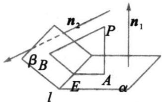

## 知识点 04 用向量方法求空间角

## (1) 求异面直线所成的角

已知 a, b 为两异面直线，A, C 与 B, D 分别是 a, b 上的任意两点，a, b 所成的角为 $\theta$ ,

则 $\cos\theta=\frac{\left|\begin{matrix}AC\cdot BD\\ \end{matrix}\right|}{\left|\begin{matrix}AC\end{matrix}\right|\cdot\left|\begin{matrix}BD\end{matrix}\right|}$

## (2) 求直线和平面所成的角

设直线 $l$ 的方向向量为 $a$ ，平面 $\alpha$ 的法向量为 $u$ ，直线与平面所成的角为 $\theta$ ， $a$ 与 $u$ 的角为 $\varphi$

则有 $\sin \theta = |\cos \varphi| = \frac{|a\cdot u|}{|a|\cdot|u|}$

## (3) 求二面角

如图，若 $PA \perp \alpha$ 于 $A, PB \perp \beta$ 于 $B$ ，平面 $PAB$ 交 $l$ 于 $E$ ，则 $\angle AEB$ 为二面角 $\alpha - l - \beta$ 的平面角， $\angle AEB + \angle APB = 180^{\circ}$

若 $n_{1}, n_{2}$ 分别为面 $\alpha, \beta$ 的法向量， $\cos\left\langle\vec{n}_{1}, n_{2}\right\rangle = \frac{\vec{n}_{1} \cdot \vec{n}_{2}}{\left|\vec{n}_{1}\right| \cdot \left|\vec{n}_{2}\right|}$ 则二面角的平面角 $\angle AEB = \left\langle\vec{n}_{1}, n_{2}\right\rangle$ 或 $\pi - \left\langle\vec{n}_{1}, n_{2}\right\rangle$

即二面角 $\theta$ 等于它的两个面的法向量的夹角或夹角的补角.

①当法向量 $n_{1}$ 与 $n_{2}$ 的方向分别指向二面角的内侧与外侧时，二面角 $\theta$ 的大小等于 $n_{1}, n_{2}$ 的夹角 $\left\langle n_{1}, n_{2} \right\rangle$ 的大小.

②当法向量 $n_{1},n_{2}$ 的方向同时指向二面角的内侧或外侧时，二面角 $\theta$ 的大小等于 $n_{1},n_{2}$ 的夹角的补角 $\pi-\left\langle n_{1},n_{2}\right\rangle$

的大小.
