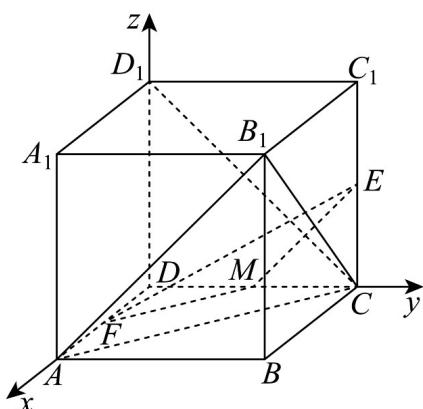

## 知识点 05 用向量方法求空间距离

1. 求点面距的一般步骤：①求出该平面的一个法向量；②找出从该点出发的平面的任一条斜线段对应的向量；

③求出法向量与斜线段向量的数量积的绝对值再除以法向量的模，即可求出点到平面的距离。

即：点 $A$ 到平面 $\alpha$ 的距离 $d = \frac{\left|AB\cdot n\right|}{|n|}$ ，其中 $B \in \alpha$ ， $n$ 是平面 $\alpha$ 的法向量。

2.线面距、面面距均可转化为点面距离，用求点面距的方法进行求解.

直线 $a$ 与平面 $\alpha$ 之间的距离： $d = \frac{\left|\overrightarrow{AB} \cdot \overrightarrow{n}\right|}{\left|n\right|}$ ，其中 $A \in a, B \in \alpha$ ， $n$ 是平面 $\alpha$ 的法向量。两平行平面 $\alpha, \beta$ 之间的距离： $d = \frac{\left|\overrightarrow{AB} \cdot \overrightarrow{n}\right|}{\left|n\right|}$ ，其中 $A \in \alpha, B \in \beta$ ， $n$ 是平面 $\alpha$ 的法向量。

3. 点线距设直线 $l$ 的单位方向向量为 $u$ ， $A \in l$ ， $P \notin l$ ，设 $AP = a$ ，则点 $P$ 到直线 $l$ 的距离 $d = \sqrt{\left|a\right|^2 - (a \cdot u)^2}$ .

【即学即练】

1. 已知棱长为 1 的正方体 $ABCD - A_{1}B_{1}C_{1}D_{1}$ 的所有顶点都在以 O 为球心的球面上，点 E 是棱 $BB_{1}$ 的中点，点 P 是棱 AD 上的动点，则下列说法正确的有（）

A. 若 P 是棱 AD 的中点，则 $PE \parallel$ 平面 $BC_{1}D$ B. 点 P 到直线 $A_{1}E$ 的距离的最小值为 $\frac{4}{5}$ C. 棱 AD 上存在点 P，使得 $\angle D_{1}B_{1}P = \frac{\pi}{4}$ D. 若 P 是棱 AD 的三等分点，则过 P 的平面截球 O 所得的截面面积最小为 $\frac{2\pi}{9}$

【答案】 ACD

【分析】对于 $^{A}$ ，设 $BC_{1}$ 的中点为F，通过证明四边形EFDP为平行四边形，可证得 $PE//$ 平面 $BC_{1}D$ ；对于B，通过建系设点 $P(x,0,0)$ ，利用空间点到线的距离公式可求最小值；对于C，利用向量的坐标表示出夹角 $\angle D_{1}B_{1}P$ ，计算出当 $x=\frac{1}{2}$ 时， $\angle D_{1}B_{1}P=\frac{\pi}{4}$ ，即可判断；对于D，由题意可求 $|OP|$ ，再利用球的截面问题可直

接求截面面积的最小值·

【详解】如图，设 $BC_{1}$ 的中点为F，连接EF,DF，

是 中点，，且

$\because E \quad BB_{1} \quad \therefore EF // B_{1}C_{1} \quad EF = \frac{1}{2}B_{1}C_{1}$

对于 $\mathsf{A}$ ，若 $P$ 是 $AD$ 中点， $\therefore DP//BC$ ，且 $DP = \frac{1}{2} BC$

∴ EF // DP，且 EF = DP，所以四边形 EFDP 为平行四边形，

$\therefore PE//DF$ ，又 $PE\not\subset$ 平面 $BC_{1}D$ ， $DF\subset$ 平面 $BC_{1}D$

$\therefore PE//_{平面}BC_{1}D$ ，故 $^{A}$ 正确；

根据题意，以 $D$ 为原点，以直线 $DA, DC, DD_{1}$ 所在方向分别为 $x, y, z$ 轴建立空间直角坐标系，

设 $P(x,0,0),x\in [0,1]$ ， $A_{1}(1,0,1),E\left(1,1,\frac{1}{2}\right)$ ， $\begin{array}{l}\square \square \square \\ A_1E = (0,1, - \frac{1}{2})\\ A_1P = (x - 1,0, - 1) \end{array}$

所以点 $_{P}$ 到直线 $A_{1}E$ 的距离 $d=\sqrt{\left|\begin{matrix}\vec{A_{1}}\vec{P}\\ \vec{A_{1}}\vec{P}\end{matrix}\right|^{2}-\left(\begin{matrix}\vec{A_{1}}\vec{P}\cdot\vec{A_{1}}\vec{E}\\ \vec{A_{1}}\vec{E}\end{matrix}\right)^{2}}=\sqrt{(x-1)^{2}+\frac{4}{5}}$

即点 $P$ 到直线 $A_{1}E$ 的距离的最小值为 $\frac{2\sqrt{5}}{5}$ ，故B错误；

对于 $\mathbb{C}$ ， $B_{1}(1,1,1),D_{1}(0,0,1)$ ，所以 $\overline{B_1P} = (x - 1, - 1, - 1),\overline{B_1D_1} = (-1, - 1,0)$

则 $\cos \angle D_{1}B_{1}P = \frac{\boxed{B_{1}P\cdot B_{1}D_{1}}}{\left|B_{1}P\right|\left|B_{1}D_{1}\right|} = \frac{-x + 1 + 1}{\sqrt{2}\times\sqrt{(x - 1)^{2} + 2}}$ ，当 $x = \frac{1}{2}$ 时， $\cos \angle D_1B_1P = \frac{\sqrt{2}}{2}$ ，即 $\angle D_1B_1P = \frac{\pi}{4}$

所以棱 AD 上存在点 P，使得 $\angle D_{1}B_{1}P=\frac{\pi}{4}$ ，故 C 正确；

对于 ${}^{\mathrm{D}}$ ，当 $P$ 是棱 $AD$ 的三等分点时，点 $P\left(\frac{1}{3},0,0\right)$ 或 $P\left(\frac{2}{3},0,0\right)$ ，球心 $O\left(\frac{1}{2},\frac{1}{2},\frac{1}{2}\right)$

所以 $\left|OP\right|^{2}=\frac{19}{36}$ ，又正方体外接球半径 $R=\frac{\sqrt{3}}{2}$ ，

所以截面所得圆的最小半径 $r = \sqrt{R^{2} - |OP|^{2}} = \sqrt{\frac{3}{4} - \frac{19}{36}} = \frac{\sqrt{2}}{3}$ ，其面积为 $S = \pi r^{2} = \frac{2\pi}{9}$ ，故 D 正确.

故选：ACD.

2．在棱长为1的正方体 $ABCD - A_1B_1C_1D_1$ 中，点 $F$ 在底面 $ABCD$ 内运动（含边界），点 $E$ 是棱 $CC_{1}$ 的中点，则

( )

A. 若 $F$ 是棱 $AD$ 的中点，则 $EF \parallel$ 平面 $AB_{1}C$

B. 若 $EF \perp$ 平面 $B_{1}D_{1}E$ ，则 $F$ 是 $AC$ 上靠近 $C$ 的四等分点

C. 点 $E$ 到平面 $B_{1}D_{1}C$ 的距离为 $\frac{\sqrt{3}}{3}$

D．若 $F$ 在棱 $AB$ 上运动，则点 $F$ 到直线 $B_{1}E$ 的距离最小值为 $\frac{2}{5}\sqrt{5}$

【答案】ABD

【分析】利用面面平行证明线面平行，判断 $A$ ；建立空间直角坐标系，利用向量法判断线面垂直判断 $B$ ，利

用等体积法求得点到直线的距离 $C$ ，利用向量法求得点到直线的距离判断D.

【详解】对于 $^{A}$ ，如图，取DC的中点M，连接ME、MF，

因为点 M 、 F 是 CD 、 AD 的中点，所以 MF // AC ，

因为 $MF \notin$ 平面 $AB_{1}C$ ， $AC \subset$ 平面 $AB_{1}C$ ，所以 $MF \parallel$ 平面 $AB_{1}C$ ，

同理 $ME \parallel DC_{1}$ ，且 $DC_{1} \parallel AB_{1}$ ，所以 $ME \parallel AB_{1}$ 。

因为 $ME \not\subset$ 平面 $AB_{1}C$ ， $AB_{1} \subset$ 平面 $AB_{1}C$ ，所以 $ME \parallel$ 平面 $AB_{1}C$ ，

且 $ME \cap MF = M$ ，ME、 $MF \subset$ 平面 MEF，所以平面 $MEF \parallel$ 平面 $AB_{1}C$ ，

因为 $EF \subset$ 平面 MEF ，所以 $EF \parallel$ 平面 $AB_{1}C$ ，A 对；

对于 $^{B}$ ，若 F 是 AC 上靠近 C 的四等分点，

以 $D$ 为坐标原点， $DA$ 、 $DC$ 、 $DD_{1}$ 所在直线为坐标轴建立如图所示的空间直角坐标系，

则 $F\left(\frac{1}{4}, \frac{3}{4}, 0\right)$ ， $E\left(0, 1, \frac{1}{2}\right)$ ， $B_1(1, 1, 1)$ ， $D_1(0, 0, 1)$

所以 $EF=\left(\frac{1}{4},-\frac{1}{4},-\frac{1}{2}\right)$ ， $B_{1}D_{1}=(-1,-1,0)$ ， $B_{1}E=\left(-1,0,-\frac{1}{2}\right)$

$$
\stackrel {{\sqcup \sqcup}} {E F} \cdot \stackrel {{\sqcup \sqcup \sqcup}} {B _ {1} D _ {1}} = 0 \quad \stackrel {{\sqcup \sqcup}} {E F} \cdot \stackrel {{\sqcup \sqcup}} {B _ {1} E} = 0
$$

所以 $EF \perp B_{1}D_{1}$ ， $EF \perp B_{1}E$ ，且 $B_{1}D_{1} \cap B_{1}E = B_{1}$ ， $B_{1}D_{1}$ 、 $B_{1}E \subset$ 平面 $B_{1}D_{1}E$

所以 $EF \perp$ 平面 $B_{1}D_{1}E$ ，且过点 E 只有 1 条直线和平面 $B_{1}D_{1}E$ 垂直，

则点 F 是唯一的，点 F 是 AC 上靠近 C 的四等分点，故 B 正确；

对于 $C$ ，因为 $E$ 是棱 $CC_{1}$ 的中点，所以点 $E$ 到平面 $B_{1}D_{1}C$ 的距离为 $C_{1}$ 点到平面 $B_{1}D_{1}C$ 的距离的 $\frac{1}{2}$

由题意可得 $\triangle B_{1}D_{1}C$ 是等边三角形，且 $B_{1}D_{1} = \sqrt{2}$ ，设 $C_1$ 点到平面 $B_{1}D_{1}C$ 的距离为 $d$ ，

由 $V_{C_{1}-B_{1}D_{1}C}=V_{C-B_{1}D_{1}C_{1}}$ ，所以 $\frac{1}{3}S_{\triangle B_{1}D_{1}C}\times d=\frac{1}{3}S_{\triangle B_{1}D_{1}C_{1}}\times CC_{1}$ ，

所以 $\frac{1}{2}\times\sqrt{2}\times\sqrt{2}\times\sin\frac{\pi}{3}\times d=\frac{1}{2}\times1\times1\times1$ ，解得 $d=\frac{\sqrt{3}}{3}$ ，

所以点 E 到平面 $B_{1}D_{1}C$ 的距离为 $\frac{\sqrt{3}}{6}$ ，C 错；

对于 D，若点 F 在棱 AB 上运动，设 $F(1,y,0)$ ， $0 \leq y \leq 1$ ，

$$
\stackrel {\square \square \square} {F B _ {1}} = (0, 1 - y, 1) \quad , \quad \stackrel {\square \square \square} {B _ {1} E} = \left(- 1, 0, - \frac {1}{2}\right)
$$

则点到 $D_{1} = \sqrt{\frac{FB_{1}}{FB_{2}}^{2} - \left(\frac{FB_{1} - B_{1}E}{|B_{1}E|}\right)^{2}} = \sqrt{(1 - y)^{2} + 1 - \frac{1}{5}} = \sqrt{(y - 1)^{2} + \frac{4}{5}}$

当 y=1 时，d 的最小值为 $\overline{5}$ ，D 对.

故选：ABD
