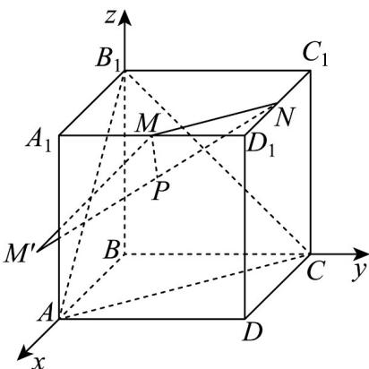

> [!faq]- 《专题1_4_空间向量的应用_高效培优讲义_》官方解析
>
> > [!success]- **【答案】** D
>
> > [!note]- **【分析】**
> > 根据给定条件，建立空间直角坐标系，求出平面 $ACB_{1}$ 的方程，点 $M$ 关于平面 $ACB_{1}$ 的对称点坐标，
> >
> > 结合对称求出最小值·
>
> > [!note]- **【解析】**
> > 在棱长为 $^{1}$ 的正方体 $ABCD-A_{1}B_{1}C_{1}D_{1}$ 中，建立如图所示的空间直角坐标系，
> >
> > 
> >
> > 则 $A(1,0,0),C(0,1,0),B_{1}(0,0,1),M(1,\frac{1}{2},1),N(\frac{1}{2},1,1)$ ，平面 $ACB_{1}$ 的截距式方程方程为 $x + y + z = 1$
> >
> > $\overline{AC}=(-1,1,0),\overline{AB}_{1}=(-1,0,1)$ ，设 $ACB_{1}$ 的法向量 $n=(a,b,c)$ ，则 $\left\{\begin{aligned}&n\cdot\overline{AC}=-a+b=0\\&\rightarrow\overline{AB}_{1}\\&n\cdot AB_{1}=-a+c=0\end{aligned}\right.$
> >
> > 令 $a = 1$ ，得 $n = (1,1,1)$ ，令点 $M$ 关于平面 $ACB_{1}$ 的对称点为 $M^{\prime}(x_0,y_0,z_0)$
> >
> > 则 $\left\{ \begin{array}{l} \frac{x_0 - 1}{1} = \frac{y_0 - \frac{1}{2}}{1} = \frac{z_0 - 1}{1} \\ \frac{x_0 + 1}{2} + \frac{y_0 + \frac{1}{2}}{2} + \frac{z_0 + 1}{2} = 1 \end{array} \right.$ ，解得，即，
> >
> > 连接 $NM'$ 交平面 $ACB_{1}$ 于点 $P'$ ，则 $P'$ 在 $\triangle ACB_{1}$ 内，且 $P'M = P'M', PM = PM'$ ，
> >
> > 因此 $\triangle MPN$ 的周长 $PM + PN + MN = PM' + PN + MN\quad NM' + MN = \frac{\sqrt{14}}{2} +\frac{\sqrt{2}}{2}$
> >
> > 当且仅当 P 与 $P'$ 重合时取等号，所以 $\triangle MPN$ 周长的最小值为 2
> >
> > $$
> > \frac {\sqrt {2} + \sqrt {1 4}}{2}
> > $$
> >
> > 故选 **D**
