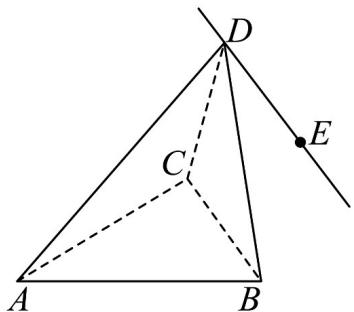

<!-- question-source:start -->
【变式1】已知三棱锥 $D - ABC$ ，VABC是边长为2的正三角形， $\angle DAB = \angle DAC = \frac{\pi}{3}$ ， $AD = 3$

(1)证明： $AD \perp BC$ ；

(2)动点 E 满足 $\overline{DE} = \lambda \overline{CB} (\lambda \in \mathbb{R})$ ，求直线 CE 与平面 ABD 所成角的正弦值的最大值。
<!-- question-source:end -->

![[高中/课堂同步/题库/人教A版高中数学同步讲义(2026)/03_选择性必修第一册/第一章 空间向量与立体几何/讲义/专题1_4_空间向量的应用_高效培优讲义_/题型04_异面直线所成的角_sec_14/questions/answers/Q00062866A1.md]]
