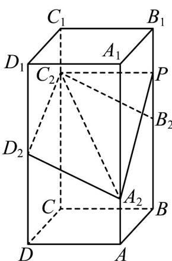

<!-- question-source:start -->
【变式3】如图，在正四棱柱 $ABCD - A_{1}B_{1}C_{1}D_{1}$ 中， $AB = 2, AA_{1} = 4$ ，点 $A_{2}, B_{2}, C_{2}, D_{2}$ 分别在棱 $AA_{1}, BB_{1}, CC_{1}$ ， $DD_{1}$ 上， $AA_{2} = 1, BB_{2} = DD_{2} = 2, CC_{2} = 3$ ，若点 $P$ 在棱 $BB_{1}$ 上，当二面角 $P - A_{2}C_{2} - D_{2}$ 为 $150^{\circ}$ 时，则 $B_{2}P =$

<!-- question-source:end -->

![[高中/课堂同步/题库/人教A版高中数学同步讲义(2026)/03_选择性必修第一册/第一章 空间向量与立体几何/讲义/专题1_4_空间向量的应用_高效培优讲义_/题型04_异面直线所成的角_sec_14/questions/answers/Q00062871A1.md]]
