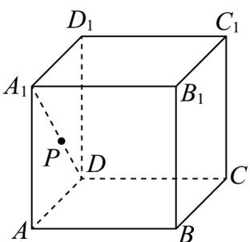

<!-- question-source:start -->
【变式1】如图，在棱长为 $^{1}$ 的正方体 $ABCD-A_{1}B_{1}C_{1}D_{1}$ 中，点P在线段 $A_{1}D$ 上（含端点）运动，下列选项中

正确的有（）

A. 线段 $B_{1}P$ 长度的最大值是 $\sqrt{3}$ B. 点 $P$ 到平面 $AB_{1}C$ 的距离是定值 $\frac{\sqrt{2}}{2}$ C. 直线 $B_{1}P$ 与 $BD$ 所成角的最小值是 $30^{\circ}$ D. 直线 $B_{1}P$ 与平面 $A_{1}BD$ 所成角的正弦值的取值范围是 $\left[\frac{1}{3}, \frac{\sqrt{3}}{3}\right]$
<!-- question-source:end -->

![[高中/课堂同步/题库/人教A版高中数学同步讲义(2026)/03_选择性必修第一册/第一章 空间向量与立体几何/讲义/专题1_4_空间向量的应用_高效培优讲义_/题型04_异面直线所成的角_sec_14/questions/answers/Q00062872A1.md]]
