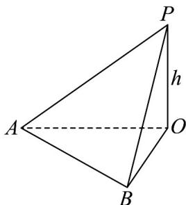

<!-- question-source:start -->
【变式3】在地平面上有一竖直的旗杆OP（O在地平面上），为了测得它的高度，在地平面上取一基线AB，

测得其长为 $20\mathrm{m}$ . 在 $\mathrm{A}$ 处测得 $P$ 点的仰角为 $30^{\circ}$ , 在 $B$ 处测得 $P$ 点的仰角为 $45^{\circ}$ , 又测得 $\angle AOB = 30^{\circ}$ .

(1)求旗杆的高度 $h$ ；

(2)求点A到平面 $POB$ 的距离.
<!-- question-source:end -->

![[高中/课堂同步/题库/人教A版高中数学同步讲义(2026)/03_选择性必修第一册/第一章 空间向量与立体几何/讲义/专题1_4_空间向量的应用_高效培优讲义_/题型04_异面直线所成的角_sec_14/questions/answers/Q00062874A1.md]]
