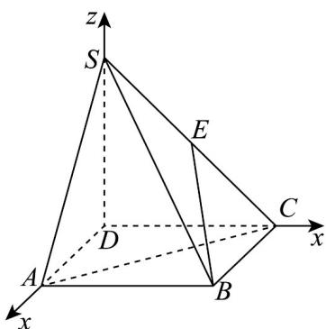
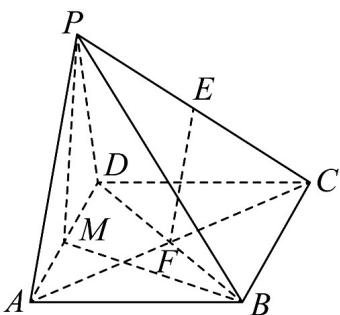
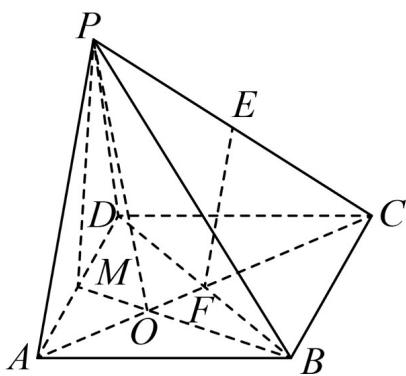
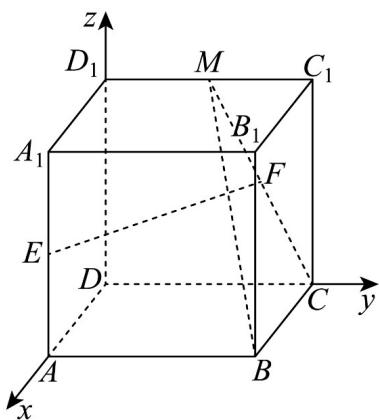

> [!faq]- 《专题1_4_空间向量的应用_高效培优讲义_》官方解析
>
> > [!success]- **【答案】** A
>
> > [!note]- **【分析】**
> > 以 D 为原点，分别以 DA, DC, DS 所在直线为 x, y, z 轴建立空间直角坐标系，设 SD = AD = 2 ，求出
> >
> > $\overset{\text{UUU}}{EB} \quad \overset{\text{UUU}}{AC}$ ，再由向量的夹角公式计算可得答案·
>
> > [!note]- **【解析】**
> > 因为 $SD \perp$ 平面 ABCD ，底面 ABCD 是正方形，
> >
> > 故以 $D$ 为原点，分别以 $DA, DC, DS$ 所在直线为 $x, y, z$ 轴建立空间直角坐标系，
> >
> > 设 $SD = AD = 2$ ，则 $A(2,0,0)$ ， $B(2,2,0)$ ， $C(0,2,0)$ ， $S(0,0,2)$
> >
> > 因为点 $E$ 为 $SC$ 中点，所以 $E(0,1,1)$
> >
> > 所以 $\stackrel{\square\square}{EB}=(2,1,-1)$ ， $\stackrel{\square\square\square}{AC}=(-2,2,0)$
> >
> > 设异面直线 $EB$ 与 $AC$ 所成角为 $\theta$
> >
> > 则 $\cos\theta=\frac{\left|\begin{matrix}EB\cdot AC\\ \vdots\end{matrix}\right|}{\left|EB\right|\left|AC\right|}=\frac{2}{\sqrt{6}\times2\sqrt{2}}=\frac{\sqrt{3}}{6}.$
> >
> > 故选：A.
> >
> > 
> >
> > 题型05 线面角
> >
> > 【典例1】如图，四棱锥 $P - ABCD$ 中， $ABCD$ 是菱形， $\angle DAB = 60^{\circ}$ ， $PA = PD$ ， $E, F, M$ 分别为 $PC, BD$ 和
> >
> > $AD_{的中点}$
> >
> > 
> >
> > (1)求证： $EF \parallel$ 平面 PAD；
> >
> > (2)求证：平面 $PMB \perp$ 平面 $PAD$ ；
> >
> > (3)若 $PA = AD = PB$ ，求直线 $AC$ 与平面 $PAD$ 夹角的正弦值
> >
> > 【答案】(1)证明见解析
> >
> > (2)证明见解析
> >
> > (3) $\frac{\sqrt{2}}{3}$
> >
> > 【分析】（ $^{1}$ ）根据中位线性质得线线平行，即可证线面平行；
> >
> > (2) 运用等腰三角形和等边三角形三线合一的性质证出两组线线垂直，从而得到线面垂直，线面垂直可直接
> >
> > 推出面面垂直；
> >
> > (3)
> > 解法一：由正四面体的性质求出点 $C$ 到平面 $PAD$ 的距离，即可求解；解法二：建立空间直角坐标系，
> >
> > 算出直线的方向向量和平面的法向量，代入线面所成角的正弦公式即可·
> >
> > 【详解】（1）四边形ABCD是菱形，则F是BD中点的同时也是AC中点，
> >
> > ∵ E, F 分别为 PC, AC 的中点，∴ EF 是 $\triangle PAC$ 的中位线，EF // PA
> >
> > ∵ $PA \subset_{平面} PAD$ ， $EF \not\subset_{平面} PAD$ ，
> >
> > $$
> > \therefore E F / / _ {\text { 平面 }} P A D.
> > $$
> >
> > (2) $\because PA = PD$ ， $M$ 是 $AD$ 中点，等腰三角形三线合一， $\therefore PM \perp AD$
> >
> > ∵ DA = AB， $\angle DAB = 60^{\circ}$ ，∴ $\triangle DAB$ 是等边三角形，
> >
> > ∵ M AD 是中点，等边三角形三线合一，∴ $BM \perp AD$
> >
> > ∵ $BM \cap PM = M$ ， $BM, PM \subset PMB$ ，平面
> >
> > $\therefore AD \perp_{平面} PMB$
> >
> > ∵ $AD \subset$ 平面 PAD
> >
> > 故平面 $PMB \perp$ 平面 $PAD$ .
> >
> > (3)
> > 解法一：由题意， $PA = AD = PB = PD = BD = AB$ ，
> >
> > 所以三棱锥 P-ABD 为正四面体，设棱长为 $^{2}$ ，则 $AC = 2\sqrt{3}$
> >
> > 设 BM, AF 交于点 O，连接 PO，
> >
> > 则点 O 为底面 $\triangle ABD$ 的中心， $PO \perp$ 平面 ABD，
> >
> > 由正三角形的性质可得 $BO=\frac{2\sqrt{3}}{3}$ ，所以 $PO=\sqrt{PB^{2}-BO^{2}}=\frac{2\sqrt{6}}{3}$ ，
> >
> > 由正四面体的性质可得点 $B$ 到平面 $PAD$ 的距离也为 $\frac{2\sqrt{6}}{3}$
> >
> > 又 $BC \parallel AD, BC \notin$ 平面 $APD$ , $AD \subset$ 平面 $APD$ , 所以 $BC \parallel$ 平面 $APD$ ,
> >
> > 所以点 C 到平面 PAD 的距离也为 $\frac{2\sqrt{6}}{3}$ ，
> >
> > 所以直线 $AC$ 与平面 $PAD$ 夹角的正弦值 $\frac{\frac{2\sqrt{6}}{3}}{AC} = \frac{\frac{2\sqrt{6}}{3}}{2\sqrt{3}} = \frac{\sqrt{2}}{3}$
> >
> > 
> >
> > 解法二：由（2）可知 $BM \perp MA$ ，故以 $M$ 为原点， $MA$ 为 $x$ 轴， $MB$ 为 $y$ 轴，过点 $M$ 垂直于平面 $ABCD$ 的直
> >
> > 线为 z 轴，建立空间直角坐标系，
> >
> > 设 $PA = AD = PB = 2$ ，易知， $M(0,0,0)$ ， $A(1,0,0)$ ， $D(-1,0,0)$ ， $C(-2,\sqrt{3},0)$ ， $B(0,\sqrt{3},0)$ ， $\overline{AC} = (-3,\sqrt{3},0)$ ， $\overline{AD} = (-2,0,0)$
> >
> > 再设 $P(x,y,z)$ ，由 $PA = PD = 2$ ， $PM = \sqrt{3}$ ， $PB = 2$ ，可得：
> >
> > $\left\{ \begin{array}{l}(x - 1)^2 +y^2 +z^2 = 4\\ (x + 1)^2 +y^2 +z^2 = 4\\ x^2 +y^2 +z^2 = 3\\ x^2 +(y - \sqrt{3})^2 +z^2 = 4 \end{array} \right.$ ，解得 $\left\{ \begin{array}{l}x = 0\\ y = \frac{\sqrt{3}}{3}\\ z = \frac{2\sqrt{6}}{3} \end{array} \right.,$
> >
> > 即 $P(0, \frac{\sqrt{3}}{3}, \frac{2\sqrt{6}}{3})$ ， $AP = (-1, \frac{\sqrt{3}}{3}, \frac{2\sqrt{6}}{3})$
> >
> > 设平面 PAD 的法向量 $n = (a, b, c)$
> >
> > $$
> > \left\{\begin{array}{l}n \cdot A D = 0\\\rightarrow \square \square\\n \cdot A P = 0\end{array}, \left\{\begin{array}{c}(a, b, c) \cdot (- 2, 0, 0) = 0\\(a, b, c) \cdot (- 1, \frac {\sqrt {3}}{3}, \frac {2 \sqrt {6}}{3}) = 0\end{array}, \left\{\begin{array}{c}- 2 a = 0\\- a + \frac {\sqrt {3}}{3} b + \frac {2 \sqrt {6}}{3} c = 0\end{array}, \right. \right. \right.
> > $$
> >
> > 解得 $n = (0,2\sqrt{2}, - 1)$
> >
> > 设直线 AC 与平面 PAD 夹角为 $\theta$
> >
> > $$
> > \sin \theta = \frac {\left| \overrightarrow {A C} \cdot n \right|}{\left| \overrightarrow {A C} \right| \left| n \right|} = \frac {\left| (- 3 , \sqrt {3} , 0) \cdot (0 , 2 \sqrt {2} , - 1) \right|}{2 \sqrt {3} \times 3} = \frac {2 \sqrt {6}}{6 \sqrt {3}} = \frac {\sqrt {2}}{3},
> > $$
> >
> > 故直线 AC 与平面 PAD 夹角的正弦值为 $\frac{\sqrt{2}}{3}$
> >
> > 
> >
> > 【典例2】如图，在棱长为 $^{2}$ 的正方体 $ABCD-A_{1}B_{1}C_{1}D_{1}$ 中，M、E分别是 $C_{1}D_{1}$ 、 $A_{1}A$ 的中点，点F在线段
> >
> > CM 上， $EF \parallel$ 平面 ABCD
> >
> > 
> >
> > (1)证明： $F$ 是 $MC$ 的中点；
> >
> > (2)求直线 EF 与平面 BCM 所成角的正弦值.
> >
> > 【答案】(1)证明见解析
> >
> > (2) $\frac{6\sqrt{5}}{25}$
> >
> > 【分析】（1）根基线面平行的向量表示，设出 F 的坐标，根据线面平行，说明 F 是 MC 的中点.
> >
> > (2) 建立空间直角坐标系，根据线面角的向量方法，求出线面角的正弦值.
> >
> > 【详解】（1）
> >
> > 
> >
> > 如图所示，以 D 为坐标原点，分别以 DA, DC, $DD_{1}$ 为 x, y, z 轴，建立空间直角坐标系.
> >
> > 因为正方体的棱长为 $^{2}$ ，则 $E(2,0,1), C(0,2,0), M(0,1,2)$
> >
> > 设 $F(x,y,z),CF = \lambda CM$
> >
> > $\overline{CF}=(x,y-2,z),\overline{CM}=(0,-1,2)$ ，可得 $(x,y-2,z)=\lambda(0,-1,2)$ ，解得 $\left\{\begin{aligned}x&=0\\ y&=2-\lambda\\ z&=2\lambda\end{aligned}\right.$
> >
> > 可得 $F(0,2 - \lambda ,2\lambda)$ ，则 $\overline{EF} = (-2,2 - \lambda ,2\lambda -1)$ 设平面ABCD的一个法向量 $n = (0,0,1)$
> >
> > 则 $\overline{EF} \cdot n = 0$ ，得 $2\lambda - 1 = 0$ ，解得 $\lambda = \frac{1}{2}$ ，所以 F 是 MC 的中点.
> >
> > (2)
> >
> > 
> >
> > 如图所示， $B(2,2,0)$ ， $BC=(-2,0,0)$ ， $CM=(0,-1,2)$ ，当 $\lambda=\frac{1}{2}$ 时， $EF=(-2,\frac{3}{2},0)$
> >
> > 设面 $BCM$ 的法向量 $m = (a, b, c)$ ，则 $\left\{ \begin{array}{l} m \cdot BC = 0 \\ \rightarrow \square \square \square \\ m \cdot CM = 0 \end{array} \right.$ ，即 $\left\{ \begin{array}{l} -2a = 0 \\ -b + 2c = 0 \end{array} \right.$ ，
> >
> > 令 $b = 2$ ，解得 $\left\{ \begin{array}{ll}a = 0\\ b = 2\\ c = 1 \end{array} \right.$ ，面的一个法向量 $m = (0,2,1)$
> >
> > 设直线 与平面 所成角为 $\sin \theta = \cos < \overrightarrow{EF} \cdot \overrightarrow{m} > = \frac{3}{\sqrt{5} \times \frac{5}{2}} = \frac{6\sqrt{5}}{25}$
> >
> > 所以直线 $EF$ 与平面 $BCM$ 所成角的正弦值为 $\frac{6\sqrt{5}}{25}$
> >
> > ## 方法技巧
> >
> > 设直线 $l$ 的方向向量为 $a$ ，平面 $\alpha$ 的法向量为 $u$ ，直线与平面所成的角为 $\theta$ ， $a$ 与 $u$ 的角为 $\varphi$
> >
> > 则有 $\sin \theta = |\cos \varphi| = \frac{|\vec{a} \cdot u|}{|a| \cdot |u|}$
